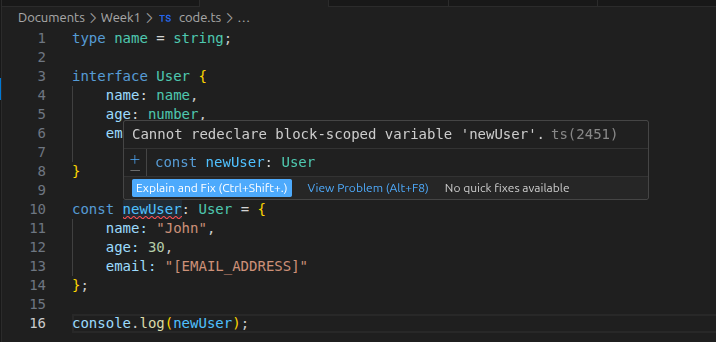
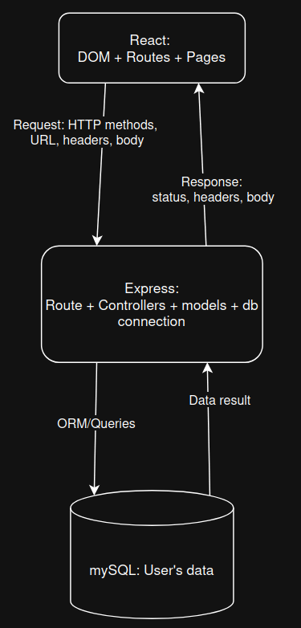

# Install Node LTS version

**Command:** nvm install --lts

# TypeScript Basic Syntax Notes

## 1. Type

**Knowledge:**
In TypeScript, `type` (Type Aliases) allows you to create a new name for any type. It doesn't create a new type, it creates a new name to refer to that type. It can be used for primitives, unions, intersections, tuples, and any other types that you'd otherwise have to write by hand. Type aliases are very flexible.

**Examples:**

```typescript
// Primitive Type
type UserID = string | number; //union type

let id1: UserID = 123;
let id2: UserID = "abc";

// Object Type
type User = {
  name: string;
  age: number;
  email?: string; // Optional property
};

const user: User = {
  name: "John",
  age: 30
};

// Intersection Type
type Employee = User & {
  employeeId: number;
};

const employee: Employee = {
  name: "Jane",
  age: 25,
  employeeId: 1001
};
```

## 2. Interface

**Knowledge:**
An `interface` is a way to define a contract on an object or a function with respect to the arguments and their type. Interfaces are primarily used to define the shape of objects. Unlike `type`, interfaces **can only** be used to declare the shapes of objects, **not rename primitives**. A key feature of interfaces is that they can be **re-opened** to add new properties (declaration merging). They can also **extend** other interfaces or classes.

**Examples:**

```typescript
interface Animal {
  name: string;
  makeSound(): void;
}

// Extending an interface
interface Dog extends Animal {
  breed: string;
}

const myDog: Dog = {
  name: "Buddy",
  breed: "Golden Retriever",
  makeSound: () => console.log("Woof!")
};

// Declaration Merging (adding properties to an existing interface)
interface Car {
  make: string;
}

interface Car {
  model: string;
}

const myCar: Car = {
  make: "Toyota",
  model: "Corolla"
};
```

## 3. Function

**Knowledge:**
Functions in TypeScript are the fundamental building blocks. TypeScript allows you to specify the types of both the input parameters and the return value. You can define functions using function declarations, arrow functions, or functional expressions. It also supports optional parameters, default parameters, and rest parameters.

**Examples:**

```typescript
// Function Declaration
function add(x: number, y: number): number {
  return x + y;
}

// Arrow Function
const multiply = (x: number, y: number): number => {
  return x * y;
};

// Optional and Default Parameters
// 'greeting' has a default value, 'name' is optional
function greet(greeting: string = "Hello", name?: string): string {
  if (name) {
    return `${greeting}, ${name}!`;
  }
  return `${greeting}!`;
}

// Rest Parameters
function sum(...numbers: number[]): number {
  return numbers.reduce((total, num) => total + num, 0);
}
```

## 4. Generics

**Knowledge:**
Generics provide a way to create reusable components that can work over a variety of types rather than a single one. They allow you to define a placeholder type (often represented by a single letter like `T`) which will be replaced by a concrete type when the component is used. This enables writing flexible, type-safe functions, classes, and interfaces.

**Examples:**

```typescript
// Generic Function
function identity<T>(arg: T): T {
  return arg;
}

let output1 = identity<string>("myString"); // Type is string
let output2 = identity<number>(100);        // Type is number

// Generic Interface
interface Box<T> {
  value: T;
}

let stringBox: Box<string> = { value: "Hello" };
let numberBox: Box<number> = { value: 42 };

// Generic Class
class DataStorage<T> {
  private data: T[] = [];

  addItem(item: T) {
    this.data.push(item);
  }

  removeItem(item: T) {
    this.data.splice(this.data.indexOf(item), 1);
  }

  getItems(): T[] {
    return [...this.data];
  }
}

const textStorage = new DataStorage<string>();
textStorage.addItem("First");
// textStorage.addItem(10); // Error: Argument of type 'number' is not assignable to parameter of type 'string'
```

# Compile TS code to JS

**Command:** npx tsc code.ts
**Output:**

**TS file**



**JS file**


# HTTP methods and status codes

## Common HTTP Methods

* **GET**: Retrieve a resource. (Idempotent - calling it multiple times has the same result)
* **POST**: Create a new resource or submit data to a server. (Not idempotent)
* **PUT**: Update an existing resource or create it if it doesn't exist (replaces the entire resource). (Idempotent)
* **PATCH**: Partially update an existing resource.
* **DELETE**: Remove a resource. (Idempotent)

## Common HTTP Status Codes

### 2xx: Success

* **200 OK**: The request succeeded (standard response for successful HTTP requests).
* **201 Created**: The request succeeded, and a new resource was created (typically after a POST).
* **204 No Content**: The request succeeded, but there is no content to return (often used for DELETE).

### 3xx: Redirection

* **301 Moved Permanently**: The requested URL has moved permanently to a new location.
* **304 Not Modified**: The resource hasn't changed since the last request (used for caching).

### 4xx: Client Errors

* **400 Bad Request**: The server cannot process the request due to a client error (e.g., malformed syntax).
* **401 Unauthorized**: Authentication is required and has failed or has not yet been provided.
* **403 Forbidden**: The client does not have access rights to the content.
* **404 Not Found**: The server can not find the requested resource.

### 5xx: Server Errors

* **500 Internal Server Error**: The server encountered an unexpected condition (generic error message).
* **502 Bad Gateway**: The server, while acting as a gateway or proxy, received an invalid response from the upstream server.
* **503 Service Unavailable**: The server is not ready to handle the request (usually down for maintenance or overloaded)

# HTTP Request

## 1. Request Structure

An HTTP request made by a client (like a browser or frontend app) to a server typically consists of:

* **Request Line**: Contains the HTTP method (GET, POST, etc.), the path (URL), and the HTTP version.
* **Headers**: Key-value pairs providing metadata about the request (e.g., `Content-Type: application/json`, `Authorization: Bearer <token>`).
* **Body (Optional)**: The data sent to the server. Commonly used in POST, PUT, and PATCH requests. GET requests usually don't have a body.

## 2. Response Structure

An HTTP response sent by the server back to the client typically consists of:

* **Status Line**: Contains the HTTP version and the Status Code (e.g., 200 OK, 404 Not Found).
* **Headers**: Metadata about the response (e.g., `Content-Type: application/json`, `Set-Cookie`).
* **Body (Optional)**: The data returned by the server (e.g., JSON data, HTML document, image).

# REST Conventions

REST (Representational State Transfer) is an architectural style for designing networked applications. It relies on standard HTTP methods and conventions.

## Key RESTful Design Principles

1. **Resource-Based URLs (Nouns, Not Verbs)**
    * URLs should represent resources (entities) rather than actions.
    * *Good:* `/users`, `/products`
    * *Bad:* `/getUsers`, `/createProduct`

2. **Plural Nouns for Collections**
    * Use plural nouns for resource endpoints to indicate a collection.
    * *Good:* `/users`, `/articles`
    * *Bad:* `/user`, `/article`

3. **Use Appropriate HTTP Methods**
    * **GET `/users`**: Retrieve a list of all users.
    * **GET `/users/123`**: Retrieve details of a specific user (ID 123).
    * **POST `/users`**: Create a new user.
    * **PUT `/users/123`**: Replace the entire user with ID 123.
    * **PATCH `/users/123`**: Partially update the user with ID 123.
    * **DELETE `/users/123`**: Delete the user with ID 123.

4. **Representing Hierarchy (Nested Resources)**
    * Use the path to show relationships between resources.
    * *Example:* `/users/123/posts` (Gets all posts belonging to user 123)
    * *Example:* `/users/123/posts/456` (Gets post 456 belonging to user 123)

5. **Statelessness**
    * Each request from the client to the server must contain all the information needed to understand and process the request. The server should not store any client context between requests.

# Architecture Diagram: User Management App

