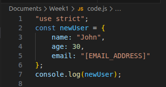

# Install Node LTS version
**Command:** nvm install --lts

# TypeScript Basic Syntax Notes

## 1. Type
**Knowledge:**
In TypeScript, `type` (Type Aliases) allows you to create a new name for any type. It doesn't create a new type, it creates a new name to refer to that type. It can be used for primitives, unions, intersections, tuples, and any other types that you'd otherwise have to write by hand. Type aliases are very flexible.

**Examples:**
```typescript
// Primitive Type
type UserID = string | number; //union type

let id1: UserID = 123;
let id2: UserID = "abc";

// Object Type
type User = {
  name: string;
  age: number;
  email?: string; // Optional property
};

const user: User = {
  name: "John",
  age: 30
};

// Intersection Type
type Employee = User & {
  employeeId: number;
};

const employee: Employee = {
  name: "Jane",
  age: 25,
  employeeId: 1001
};
```

## 2. Interface
**Knowledge:**
An `interface` is a way to define a contract on an object or a function with respect to the arguments and their type. Interfaces are primarily used to define the shape of objects. Unlike `type`, interfaces **can only** be used to declare the shapes of objects, **not rename primitives**. A key feature of interfaces is that they can be **re-opened** to add new properties (declaration merging). They can also **extend** other interfaces or classes.

**Examples:**
```typescript
interface Animal {
  name: string;
  makeSound(): void;
}

// Extending an interface
interface Dog extends Animal {
  breed: string;
}

const myDog: Dog = {
  name: "Buddy",
  breed: "Golden Retriever",
  makeSound: () => console.log("Woof!")
};

// Declaration Merging (adding properties to an existing interface)
interface Car {
  make: string;
}

interface Car {
  model: string;
}

const myCar: Car = {
  make: "Toyota",
  model: "Corolla"
};
```

## 3. Function
**Knowledge:**
Functions in TypeScript are the fundamental building blocks. TypeScript allows you to specify the types of both the input parameters and the return value. You can define functions using function declarations, arrow functions, or functional expressions. It also supports optional parameters, default parameters, and rest parameters.

**Examples:**
```typescript
// Function Declaration
function add(x: number, y: number): number {
  return x + y;
}

// Arrow Function
const multiply = (x: number, y: number): number => {
  return x * y;
};

// Optional and Default Parameters
// 'greeting' has a default value, 'name' is optional
function greet(greeting: string = "Hello", name?: string): string {
  if (name) {
    return `${greeting}, ${name}!`;
  }
  return `${greeting}!`;
}

// Rest Parameters
function sum(...numbers: number[]): number {
  return numbers.reduce((total, num) => total + num, 0);
}
```

## 4. Generics
**Knowledge:**
Generics provide a way to create reusable components that can work over a variety of types rather than a single one. They allow you to define a placeholder type (often represented by a single letter like `T`) which will be replaced by a concrete type when the component is used. This enables writing flexible, type-safe functions, classes, and interfaces.

**Examples:**
```typescript
// Generic Function
function identity<T>(arg: T): T {
  return arg;
}

let output1 = identity<string>("myString"); // Type is string
let output2 = identity<number>(100);        // Type is number

// Generic Interface
interface Box<T> {
  value: T;
}

let stringBox: Box<string> = { value: "Hello" };
let numberBox: Box<number> = { value: 42 };

// Generic Class
class DataStorage<T> {
  private data: T[] = [];

  addItem(item: T) {
    this.data.push(item);
  }

  removeItem(item: T) {
    this.data.splice(this.data.indexOf(item), 1);
  }

  getItems(): T[] {
    return [...this.data];
  }
}

const textStorage = new DataStorage<string>();
textStorage.addItem("First");
// textStorage.addItem(10); // Error: Argument of type 'number' is not assignable to parameter of type 'string'
```

# Compile TS code to JS
**Command:** npx tsc code.ts
**Output:**
**TS file and JS file**


**TS file**


**JS file**

