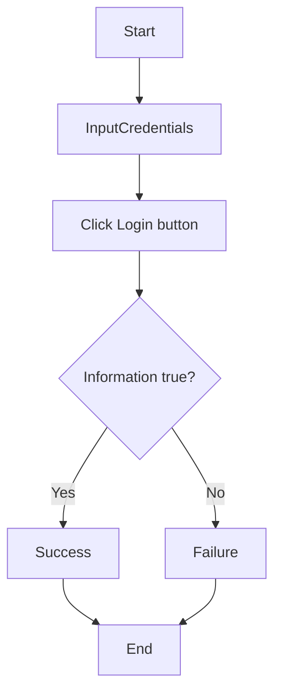
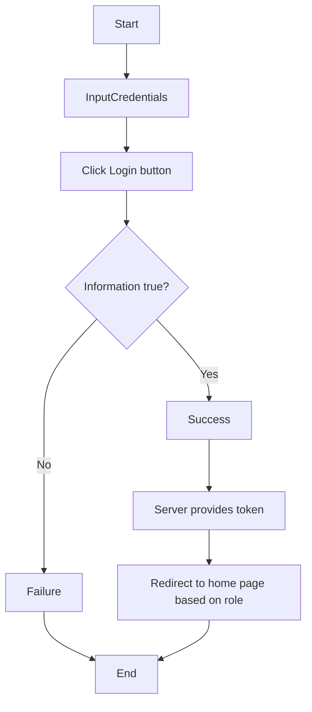

# User Login flow

## General

```mermaid
flowchart TD
    A[Start] --> B[InputCredentials]
    B --> B1[Click Login button]
    B1 --> C{Information true?}
    C -->|Yes| D[Success]
    C -->|No| E[Failure]
    D --> F[End]
    E --> F[End]
```

## Detail

```mermaid
flowchart TD
    A[Start] --> B[InputCredentials]
    B --> B1[Click Login button]
    B1 --> C{Information true?}
    C -->|Yes| D[Success]
    C -->|No| E[Failure]
    D --> G[Server provides token]
    G --> H[Redirect to home page based on role]
    E --> F[End]
    H --> F[End]
```
