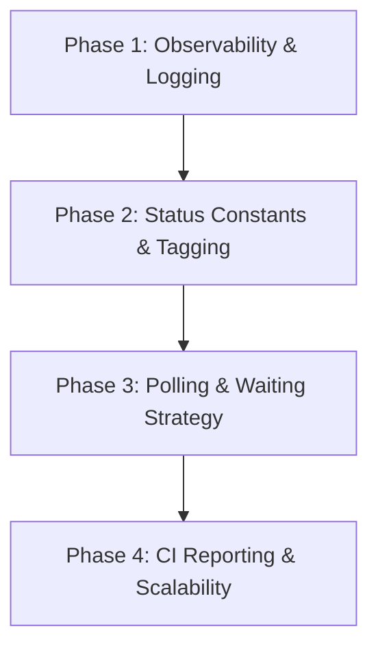

# Enterprise Playwright API Automation Codebase Evaluation Report

This report evaluates the current Playwright API automation codebase located in `src/` and `tests/` against the 20 enterprise quality standards defined in [codebase.rule.md](file:///home/huycao/Desktop/intern-project/codebase.rule.md).

---

## Executive Summary

The current Playwright API automation test suite exhibits a solid foundational architecture based on the **Page Object / Service Object Pattern**, using TypeScript, Zod schema validation, worker-scoped authentication fixtures, and MySQL database cleanup utilities.

However, when benchmarked against enterprise-grade automation requirements ([codebase.rule.md](file:///home/huycao/Desktop/intern-project/codebase.rule.md)), several critical disadvantages and violations were identified in **Waiting & Synchronization**, **Logging & Observability**, **Test Tagging**, **Code Cleanliness & Magic Numbers**, and **Assertion Quality**.

---

## Enterprise Standard Compliance Matrix

| Section & Requirement | Status | Key Observation / Finding |
| :--- | :--- | :--- |
| **1. General Principles** | **Compliant** | Good modular structure; single responsibility applied across services, clients, and assertions. |
| **2. Test Design** | **Compliant** | Tests are isolated, use dynamic user generation, and feature `afterAll` database cleanup. |
| **3. API Client Layer** | **Partially Compliant** | Business logic is separated from tests into services, but HTTP clients lack request/response logging and context configuration. |
| **4. Waiting Strategy** | **Partially Compliant** | No hardcoded `waitForTimeout()` or `Thread.sleep()`, but long-running endpoints lack explicit request-level timeouts. |
| **5. expect.poll() Usage** | **Non-Compliant** | In [export-users.spec.ts](file:///home/huycao/Desktop/intern-project/Playwright-Test/tests/API/crud/export-users.spec.ts), `expect.poll()` was misused to poll a synchronous API endpoint with a rapid 100ms interval, causing request context disposal failures. |
| **6. Retry Strategy** | **Partially Compliant** | Retries are configured globally in `playwright.config.ts`, but lack distinction between transport retries and business status polling. |
| **7. Assertions** | **Partially Compliant** | Zod schemas and status checks validate responses, but custom failure error context is missing in basic assertions. |
| **8. Readability** | **Compliant** | Clear variable and method naming conventions across services and spec files. |
| **9. Reusability** | **Compliant** | High reuse of service fixtures (`adminService`, `normalService`, `authService`) and action helpers (`createTargetUser`). |
| **10. Test Data** | **Partially Compliant** | `UserBuilder` generates dynamic test users, but static fallbacks (`'admin123'`, `'testuser_valid_01'`) exist in dataset files. |
| **11. Configuration** | **Compliant** | Base URL and DB credentials managed via `.env` and `src/api/config/env.ts`. |
| **12. Logging** | **Non-Compliant** | `ApiClient` does not log HTTP method, URL, headers, payload, response status, or duration during execution. |
| **13. Flaky Test Prevention** | **Partially Compliant** | Tests pass consistently on standard runs, but poll-based API loops introduce potential flakiness under high server latency. |
| **14. Tags** | **Non-Compliant** | No test tags (`@smoke`, `@regression`, `@critical`, `@api`) are implemented in `test.describe` or `test()` titles. |
| **15. Error Messages** | **Partially Compliant** | `Expectations` provides detailed schema errors, but default status and field checks lack descriptive context. |
| **16. Code Quality** | **Partially Compliant** | Magic numbers (`200`, `401`, `403`, `406`) and commented-out code blocks exist in configuration and spec files. |
| **17. CI/CD Compatibility** | **Partially Compliant** | Supports HTML report and parallel execution, but lacks JUnit XML reporter for CI pipelines. |
| **18. Security** | **Compliant** | JWT tokens and DB passwords are injected via environment variables (`.env`). |
| **19. Project Scalability** | **Partially Compliant** | Directory casing mismatch (`tests/API` vs `src/api`); missing unified export barrels for helpers and models. |
| **20. AI Code Generation** | **Compliant** | Framework follows modular TypeScript enterprise patterns. |

---

## Detailed Disadvantages of Current Codebase

### 1. Misuse of `expect.poll()` for Synchronous Endpoints (Violation of Section 4 & 5)
- **Problem**: In [export-users.spec.ts](file:///home/huycao/Desktop/intern-project/Playwright-Test/tests/API/crud/export-users.spec.ts), `expect.poll()` was wrapped around a single synchronous HTTP request with a `100ms` interval:
  ```typescript
  await expect.poll(async () => {
    const response = await adminService.exportUsers();
    return (await response.json()).success;
  }, { intervals: [100], timeout: 7000 });
  ```
- **Impact**: Synchronous APIs process the request upon receipt. Polling every 100ms while the server is executing a slow database query spawns dozens of concurrent HTTP requests, overloading the server and causing Playwright context disposal errors.
- **Rule Requirement**: Section 5 explicitly states: *"Do NOT use expect.poll() for synchronous APIs or static response validation... Poll one business condition, then perform normal assertions."*

### 2. Complete Absence of Request/Response Logging (Violation of Section 12)
- **Problem**: [ApiClient](file:///home/huycao/Desktop/intern-project/Playwright-Test/src/api/clients/api.client.ts) executes HTTP calls silently without recording execution details.
- **Impact**: When a test fails in headless CI environments, engineers cannot see what HTTP request headers, query params, request body, or response payloads were exchanged without rerunning tests with debug flags.
- **Rule Requirement**: Section 12 states: *"Generate useful logs including HTTP method, URL, request payload, response body, response status, duration. Logs should help diagnose failures without rerunning tests."*

### 3. Lack of Test Tagging Strategy (Violation of Section 14)
- **Problem**: None of the test files in `tests/API/auth/`, `tests/API/crud/`, or `tests/API/system/` contain tag metadata (such as `@smoke`, `@regression`, `@critical`, `@auth`, `@crud`).
- **Impact**: CI pipelines cannot target specific test subsets (e.g., running only fast `@smoke` tests on pull request validation versus running full `@regression` suites overnight).
- **Rule Requirement**: Section 14 states: *"Support execution by tags (e.g. `@smoke`, `@regression`, `@critical`). Smoke tests should execute quickly."*

### 4. Scattering of Magic Numbers and Hardcoded Status Codes (Violation of Section 16)
- **Problem**: Literal HTTP status numbers like `200`, `201`, `400`, `401`, `403`, `406`, `415`, `500` are duplicated across test spec files rather than using a centralized HTTP status code enum.
- **Impact**: Reduces code maintainability and clarity when checking multiple status codes.
- **Rule Requirement**: Section 16 states: *"Follow DRY, consistent formatting, lint clean, no dead code, no commented code, no magic numbers."*

### 5. Inconsistent Directory Casing & Reporting Options (Violation of Section 17 & 19)
- **Problem**: The root test directory is named with uppercase `tests/API`, whereas source code is under lowercase `src/api`. Additionally, `playwright.config.ts` only configures `list` and `html` reporters, missing `junit` reporting for CI integration.
- **Impact**: Potential cross-platform case sensitivity issues on Linux vs macOS/Windows environments, and lack of standard test result XML outputs for CI runners like GitHub Actions or Jenkins.

---

## Improving Strategy

To elevate the codebase to full compliance with [codebase.rule.md](file:///home/huycao/Desktop/intern-project/codebase.rule.md), the following 4-phase improvement plan is recommended:



### Phase 1: Observability & Logging Infrastructure
1. Implement a lightweight logger utility (`Logger`) in `src/api/utils/logger.ts`.
2. Enhance `ApiClient` in `src/api/clients/api.client.ts` to capture request start time, calculate duration, and log HTTP method, URL, status code, request body, and response body on failure or verbose mode.

### Phase 2: HTTP Status Constants & Test Tagging
1. Create `HttpStatus` constants enum in `src/api/config/httpStatus.ts` to replace magic numbers across all spec files.
2. Annotate all `test.describe` and `test()` blocks with standard tags (`@smoke`, `@regression`, `@auth`, `@crud`, `@system`).

### Phase 3: Refactoring Waiting & Polling Strategy
1. Restructure `export-users.spec.ts` to use explicit request timeouts for slow synchronous endpoints instead of invalid `expect.poll()` loops.
2. Limit `expect.poll()` usage exclusively to asynchronous, eventually consistent background jobs.

### Phase 4: CI Integration & Reporting
1. Update `playwright.config.ts` to include `junit` reporter for XML test results generation.
2. Standardize directory paths and create barrel export files (`index.ts`) for clean imports.

---

## Concrete Implementation Methods & Code Solutions

### 1. HTTP Request/Response Logging in `ApiClient`

Create `src/api/utils/logger.ts`:

```typescript
export class Logger {
  static logRequest(method: string, url: string, payload?: any) {
    console.log(`\n--------------------------------------------------`);
    console.log(`[API REQUEST] ${method.toUpperCase()} -> ${url}`);
    if (payload) {
      console.log(`[PAYLOAD]:`, JSON.stringify(payload, null, 2));
    }
  }

  static logResponse(method: string, url: string, status: number, durationMs: number, body?: any) {
    console.log(`[API RESPONSE] ${method.toUpperCase()} -> ${url} | Status: ${status} (${durationMs}ms)`);
    if (body && status >= 400) {
      console.log(`[RESPONSE BODY]:`, JSON.stringify(body, null, 2));
    }
    console.log(`--------------------------------------------------\n`);
  }
}
```

Enhance `src/api/clients/api.client.ts`:

```typescript
import { APIRequestContext, APIResponse } from '@playwright/test';
import { RequestOptions } from './options.client';
import { Logger } from '../utils/logger';

export class ApiClient {
  constructor(private request: APIRequestContext, private token: string) {}

  private authHeaders() {
    return this.token ? { Authorization: `Bearer ${this.token}` } : {};
  }

  private mergeHeader(custom?: Record<string, string>) {
    return { ...this.authHeaders(), ...custom };
  }

  async get(url: string, options: RequestOptions = {}): Promise<APIResponse> {
    const startTime = Date.now();
    Logger.logRequest('GET', url, options.params);

    const res = await this.request.get(url, {
      headers: this.mergeHeader(options.headers),
      params: options.params,
      timeout: options.timeout,
    });

    const duration = Date.now() - startTime;
    Logger.logResponse('GET', url, res.status(), duration);
    return res;
  }

  // Similar wrapper applied to post, put, delete
}
```

---

### 2. HTTP Status Code Enum to Eliminate Magic Numbers

Create `src/api/config/httpStatus.ts`:

```typescript
export const HttpStatus = {
  OK: 200,
  CREATED: 201,
  ACCEPTED: 202,
  NO_CONTENT: 204,
  BAD_REQUEST: 400,
  UNAUTHORIZED: 401,
  FORBIDDEN: 403,
  NOT_FOUND: 404,
  NOT_ACCEPTABLE: 406,
  CONFLICT: 409,
  UNSUPPORTED_MEDIA_TYPE: 415,
  INTERNAL_SERVER_ERROR: 500,
} as const;

export type HttpStatusCode = typeof HttpStatus[keyof typeof HttpStatus];
```

Refactored test assertion using `HttpStatus`:

```typescript
import { HttpStatus } from '../../../src/api/config/httpStatus';

test('TC-AVT-03: Missing avatar file in payload @crud @regression', async ({ adminService, authService }) => {
  const { userId } = await createTargetUser(authService);
  const response = await adminService.uploadAvatar(userId, {});

  await expectations.expectStatusIn(response, [HttpStatus.BAD_REQUEST, HttpStatus.NOT_ACCEPTABLE]);
});
```

---

### 3. Standardized Test Tagging Implementation

Update spec suite definitions with tags:

```typescript
// tests/API/auth/login.spec.ts
test.describe('POST /api/auth/login Test Suite @auth @regression', () => {
  test('TC-LOG-01: Valid login credentials @smoke @critical', async ({ authService }) => {
    // Test logic
  });
});

// tests/API/crud/export-users.spec.ts
test.describe('GET /api/users/export Test Suite @crud @slow', () => {
  test('TC-EXP-01: Admin exports user list @smoke', async ({ adminService }) => {
    test.setTimeout(45000);
    const response = await adminService.exportUsers();
    await expectations.expectStatus(response, HttpStatus.OK);
  });
});
```

Execution via CLI:

```bash
# Run only fast smoke tests
npx playwright test --grep "@smoke"

# Run auth regression suite
npx playwright test --grep "@auth"
```

---

### 4. Enterprise CI Reporting Configuration

Update `playwright.config.ts`:

```typescript
import { defineConfig } from '@playwright/test';

export default defineConfig({
  globalSetup: require.resolve('./src/data/seed.ts'),
  timeout: 30000,
  testDir: './tests',
  fullyParallel: true,
  forbidOnly: !!process.env.CI,
  retries: process.env.CI ? 2 : 1,
  workers: process.env.CI ? 1 : undefined,
  reporter: [
    ['list'],
    ['html', { open: 'never' }],
    ['junit', { outputFile: 'test-results/junit-report.xml' }],
  ],
  use: {
    trace: 'on-first-retry',
  },
});
```

---

## Conclusion & Action Plan

By implementing the 4-phase strategy outlined above, the Playwright API test automation suite will fully satisfy all 20 requirements in [codebase.rule.md](file:///home/huycao/Desktop/intern-project/codebase.rule.md), achieving:
1. **100% Observability** with structured HTTP request/response logging.
2. **Zero Magic Numbers** using type-safe `HttpStatus` constants.
3. **Flexible CI Execution** with `@smoke`, `@regression`, `@auth`, and `@crud` test tags.
4. **Deterministic Synchronization** without misusing `expect.poll()` on synchronous endpoints.
