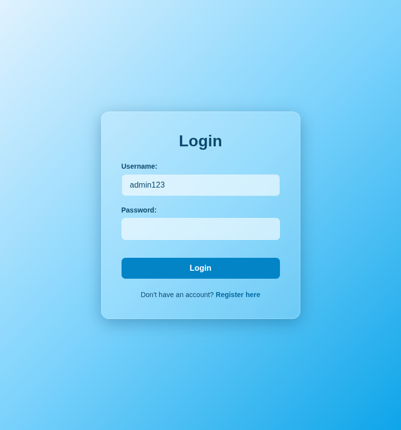
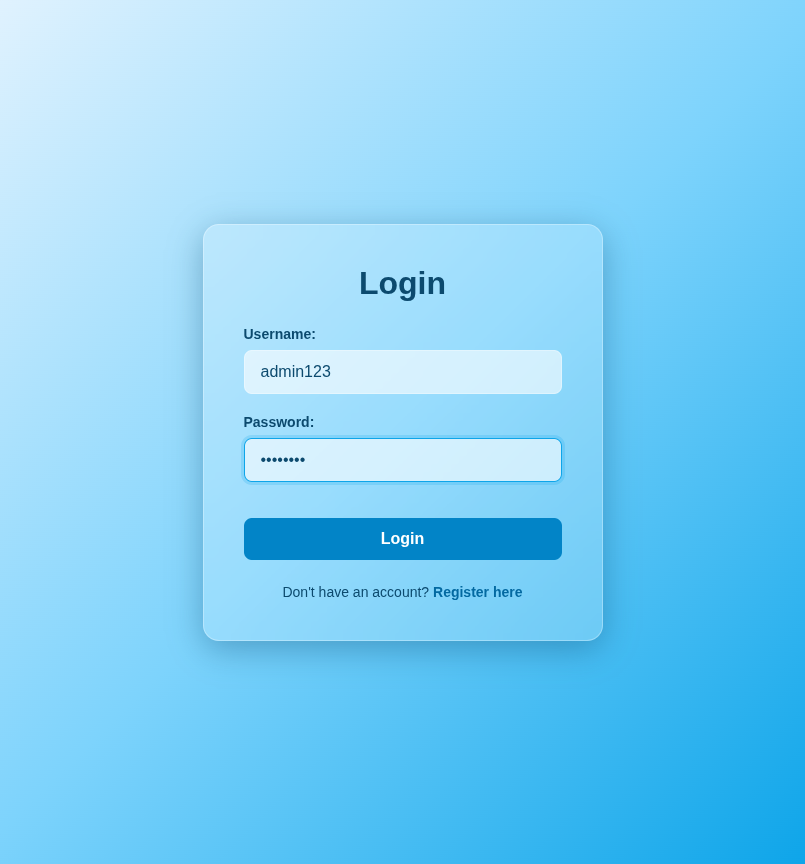
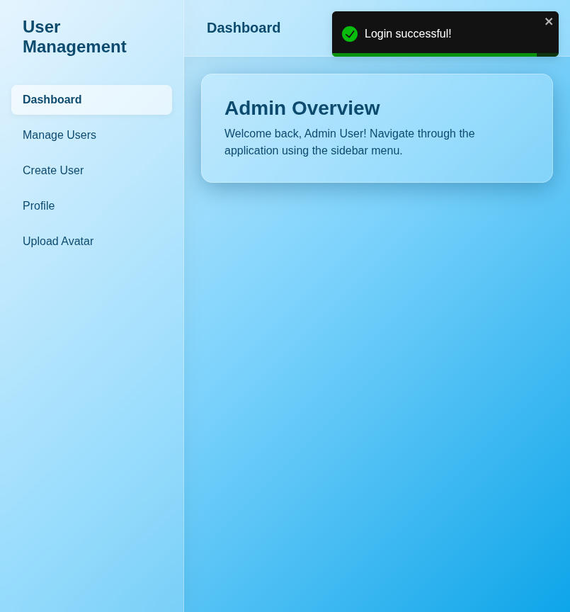

# Test Report: TC_LOG_02

## Test Case Details
- **Test Case ID:** TC_LOG_02
- **Scenario:** A1. User Login - Successful
- **Preconditions:** System has seeded admin data
- **Test Data:** 
  - Username: `admin123`
  - Password: `admin123`
- **Expected Output:** Success message displayed. Navigated to dashboard. Admin features visible.

## Execution Steps

### Step 1: Navigate to login page
The user successfully navigated to the login page.

### Step 2: Enter username
The user entered the valid admin username `admin123`.

### Step 3: Enter password
The user entered the valid admin password `admin123`.

### Step 4: Click login button
The user clicked the login button. The system displayed a success toast notification and navigated to the dashboard page.

## Execution Result
- **Status:** PASS
- **Details:** The system successfully logged the admin user in, displayed a success message, and redirected to the dashboard. No bugs were detected.
