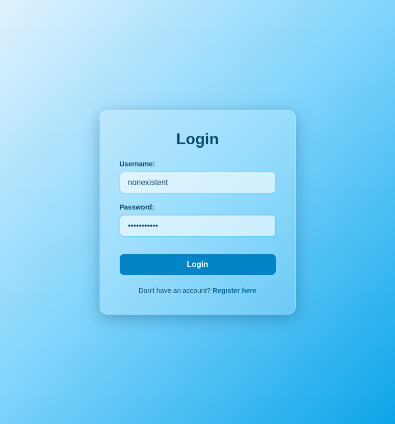
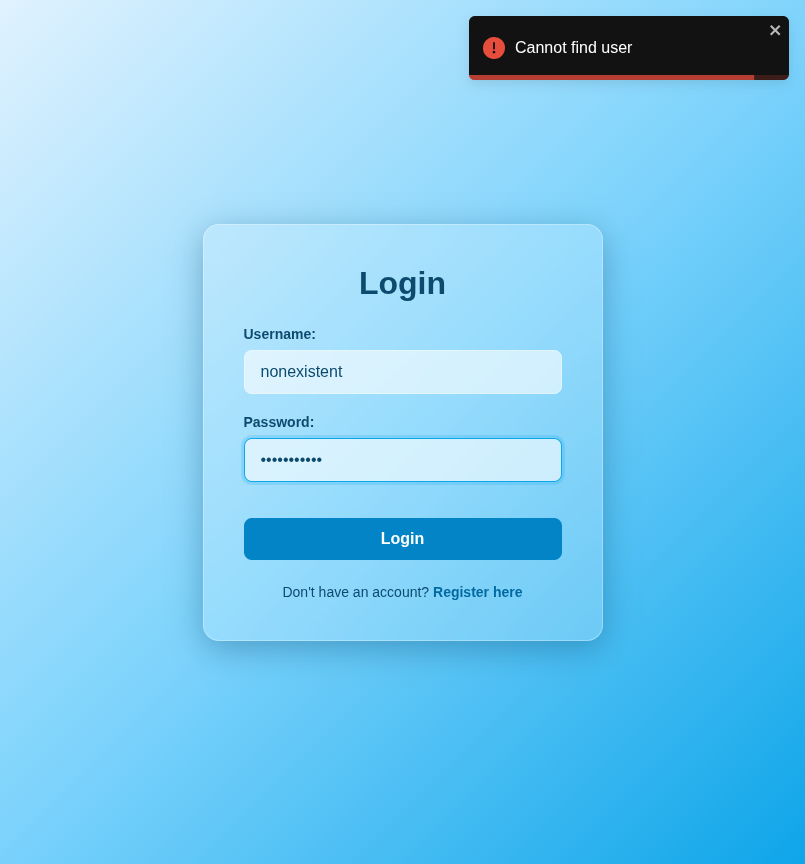

# Test Report: TC_LOG_03

## Test Case Details
- **Test Case ID:** TC_LOG_03
- **Scenario:** A2. User Login - Unregistered Username
- **Preconditions:** None
- **Test Data:** 
  - Username: `nonexistent`
  - Password: `password123`
- **Expected Output:** Error message displayed. System remains on login page.

## Execution Steps

### Step 1: Navigate to login page
The user successfully navigated to the login page.

### Step 2: Enter unregistered username
The user entered the unregistered username `nonexistent`.

### Step 3: Enter password
The user entered the password `password123`.

### Step 4: Click login button
The user clicked the login button. The system displayed an error toast notification and remained on the login page.

## Execution Result
- **Status:** PASS
- **Details:** The system successfully displayed an error toast (e.g., "User not found") and prevented login. The user remained on the login page. No bugs were detected.
