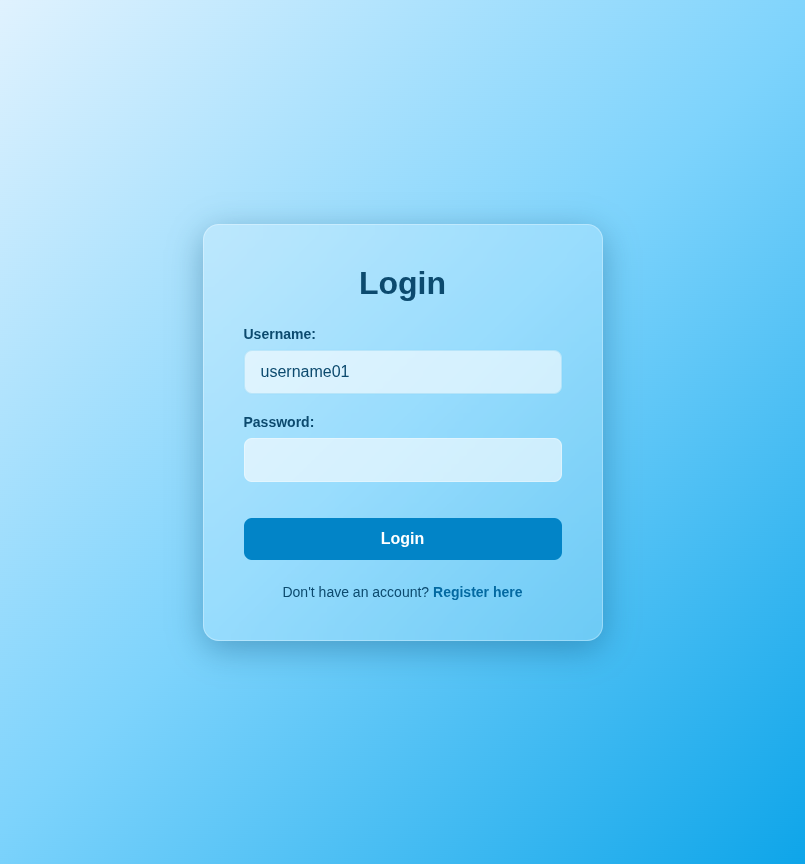
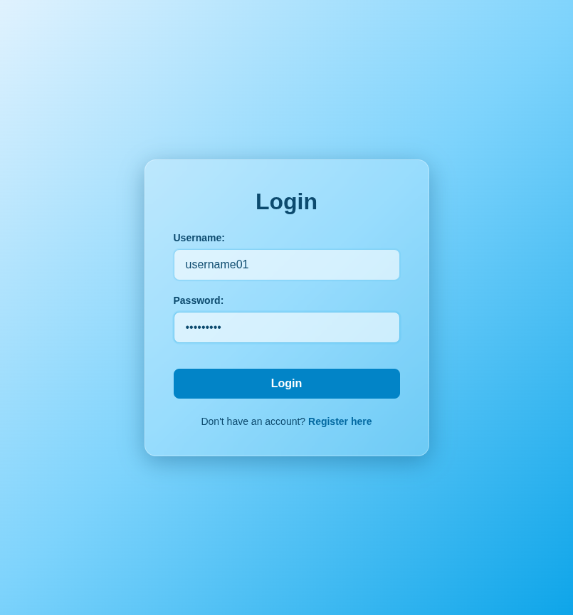
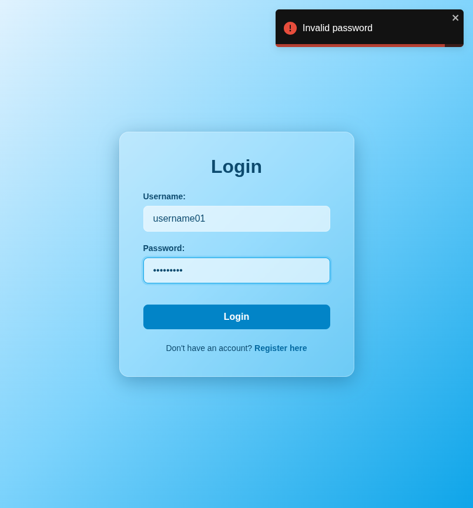

# Test Report: TC_LOG_04

## Test Case Details
- **Test Case ID:** TC_LOG_04
- **Scenario:** A3. User Login - Incorrect Password
- **Preconditions:** System has seeded user data
- **Test Data:** 
  - Username: `username01`
  - Password: `wrongpass`
- **Expected Output:** Error message displayed. System remains on login page.

## Execution Steps

### Step 1: Navigate to login page
The user successfully navigated to the login page.

### Step 2: Enter valid username
The user entered the valid username `username01`.

### Step 3: Enter incorrect password
The user entered the incorrect password `wrongpass`.

### Step 4: Click login button
The user clicked the login button. The system displayed an error toast notification and remained on the login page.

## Execution Result
- **Status:** PASS
- **Details:** The system successfully displayed an error toast stating "Invalid password" and prevented login. The user remained on the login page. No bugs were detected.
