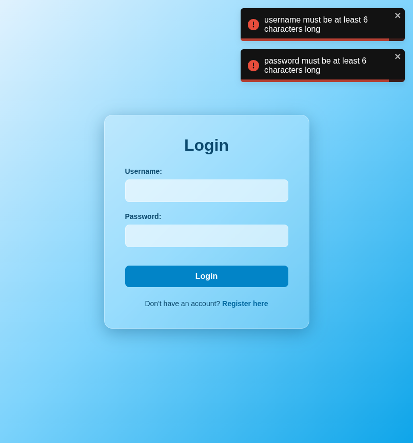

# Test Report: TC_LOG_05

## Test Case Details
- **Test Case ID:** TC_LOG_05
- **Scenario:** A4. User Login - Empty Fields
- **Preconditions:** None
- **Test Data:** 
  - Username: (empty)
  - Password: (empty)
- **Expected Output:** Validation errors displayed: "username must be at least 6 characters long", "password must be at least 6 characters long".

## Execution Steps

### Step 1: Navigate to login page
The user successfully navigated to the login page.

### Step 2: Leave fields empty
The user left both the username and password fields empty.

### Step 3: Click login button
The user clicked the login button. The system displayed validation error toast notifications and remained on the login page.

## Execution Result
- **Status:** PASS
- **Details:** The system successfully displayed validation error toasts indicating that both fields must be at least 6 characters long. The login attempt was prevented, and the user remained on the login page. No bugs were detected.
