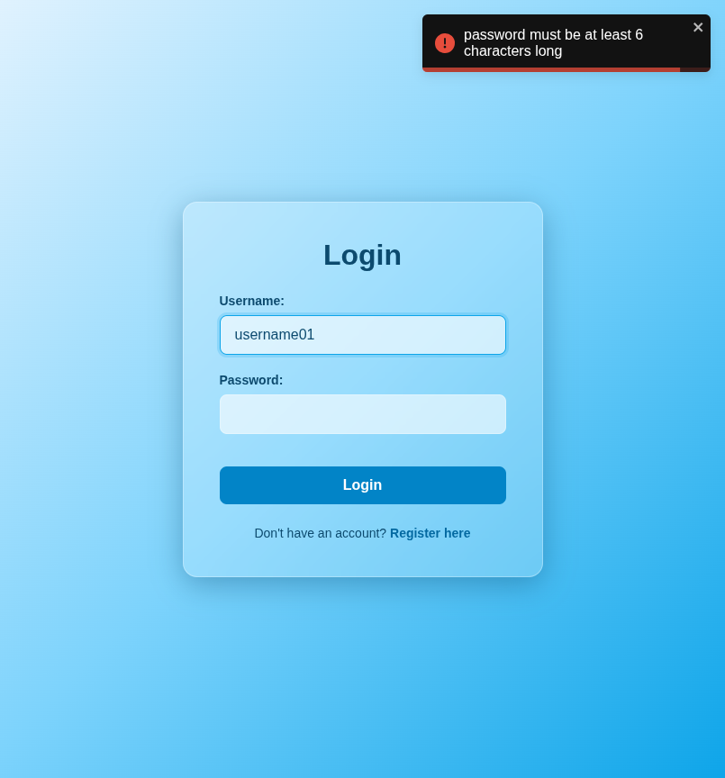

# Test Report: TC_LOG_07

## Test Case Details
- **Test Case ID:** TC_LOG_07
- **Scenario:** A4. User Login - Empty Fields
- **Preconditions:** None
- **Test Data:** 
  - Username: `username01`
  - Password: (empty)
- **Expected Output:** Validation error displayed: "password must be at least 6 characters long".

## Execution Steps

### Step 1: Navigate to login page
The user successfully navigated to the login page.

### Step 2: Enter username
The user entered the valid username `username01`.

### Step 3: Leave password empty
The user left the password field empty.

### Step 4: Click login button
The user clicked the login button. The system displayed a validation error toast notification and remained on the login page.

## Execution Result
- **Status:** PASS
- **Details:** The system successfully displayed a validation error toast indicating that the password must be at least 6 characters long. The login attempt was prevented, and the user remained on the login page. No bugs were detected.
