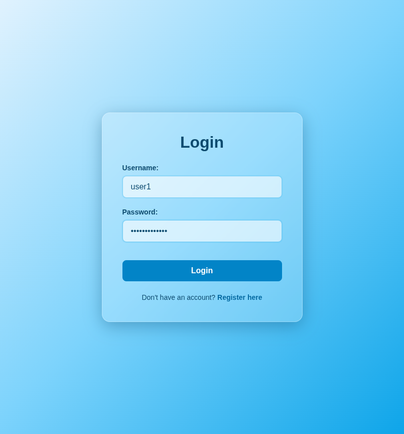
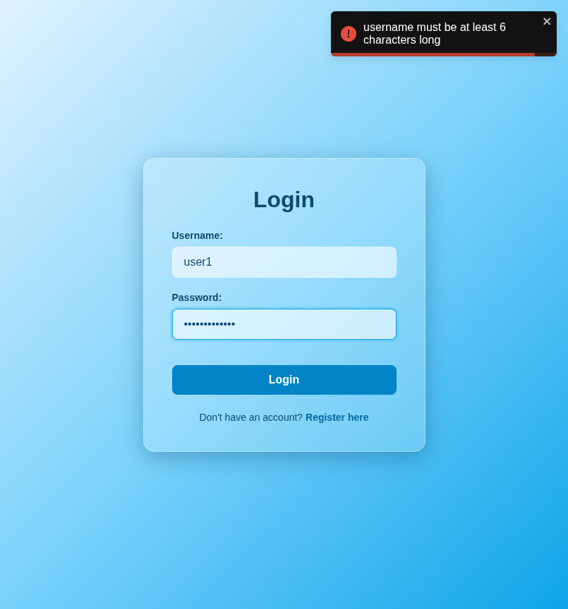

# Test Report: TC_LOG_08

## Test Case Details
- **Test Case ID:** TC_LOG_08
- **Scenario:** A4. User Login - Empty Fields (Short Username)
- **Preconditions:** None
- **Test Data:** 
  - Username: `user1`
  - Password: `userpassword1`
- **Expected Output:** Validation error displayed: "username must be at least 6 characters long".

## Execution Steps

### Step 1: Navigate to login page
The user successfully navigated to the login page.

### Step 2: Enter short username
The user entered a short username `user1`.

### Step 3: Enter password
The user entered the valid password `userpassword1`.

### Step 4: Click login button
The user clicked the login button. The system displayed a validation error toast notification and remained on the login page.

## Execution Result
- **Status:** PASS
- **Details:** The system successfully displayed a validation error toast indicating that the username must be at least 6 characters long. The login attempt was prevented, and the user remained on the login page. No bugs were detected.
