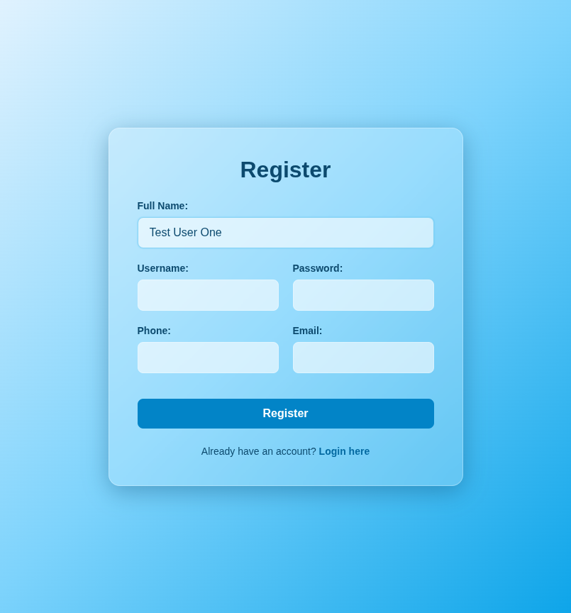
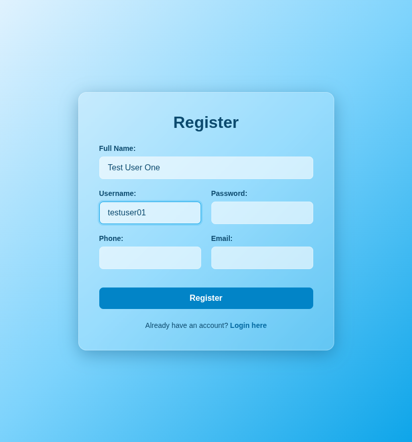
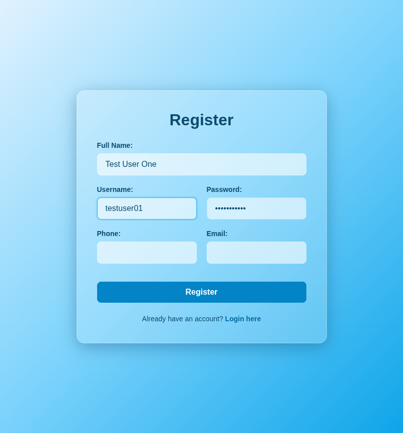
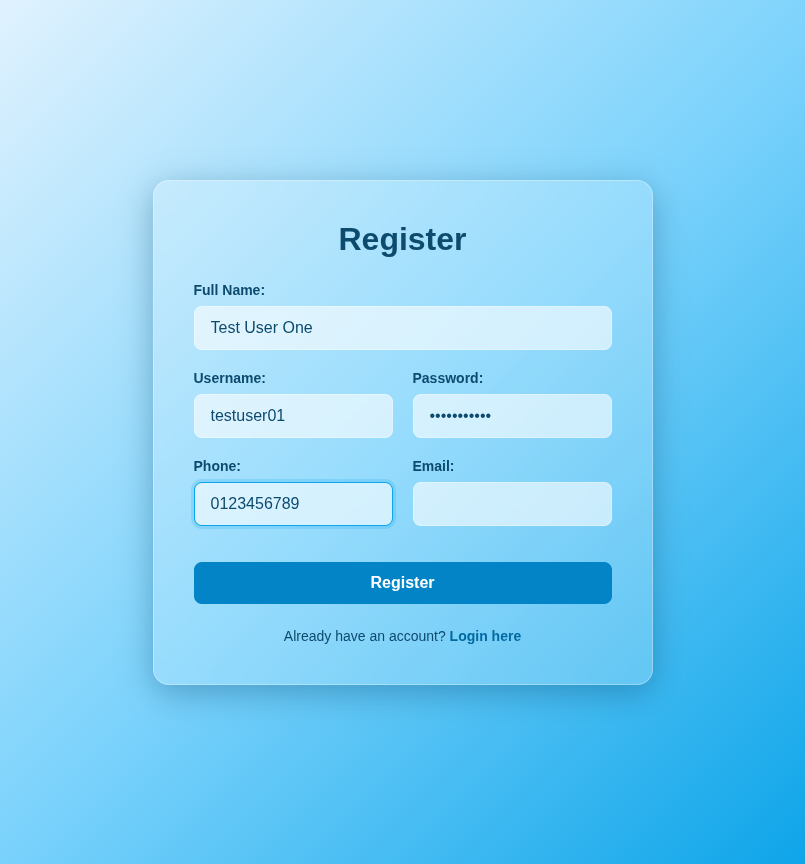
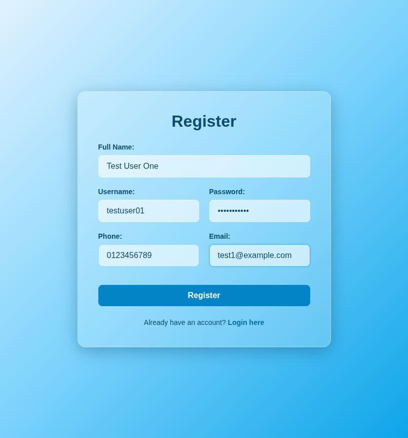
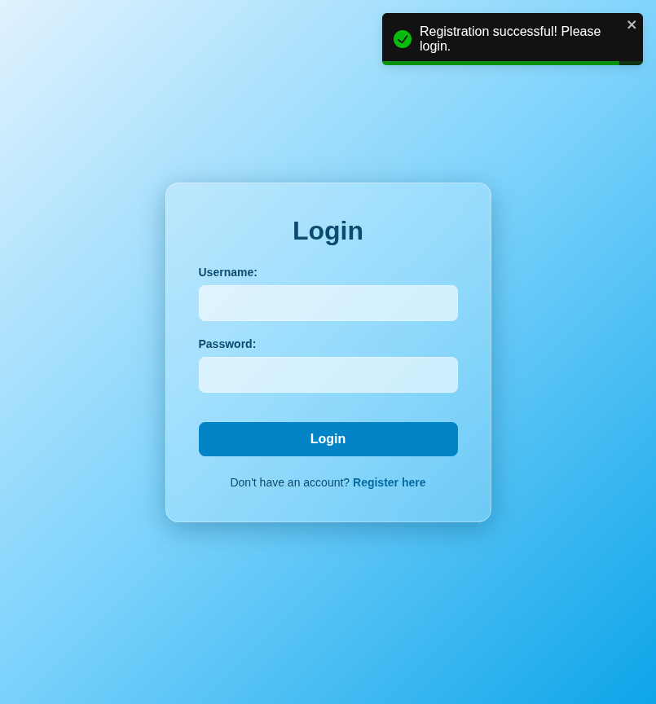

# Test Report: TC_REG_01

## Test Case Details
- **Test Case ID:** TC_REG_01
- **Scenario:** B1. User Registration - Successful (All fields)
- **Preconditions:** None
- **Test Data:** 
  - Full Name: `Test User One`
  - Username: `testuser01`
  - Password: `password123`
  - Phone: `0123456789`
  - Email: `test1@example.com`
- **Expected Output:** Success message displayed. Navigated to login page.

## Execution Steps

### Step 1: Navigate to register page
The user successfully navigated to the register page.

### Step 2: Enter full name
The user entered the full name `Test User One`.

### Step 3: Enter username
The user entered the valid username `testuser01`.

### Step 4: Enter password
The user entered the valid password `password123`.

### Step 5: Enter phone number
The user entered the phone number `0123456789`.

### Step 6: Enter email
The user entered the email address `test1@example.com`.

### Step 7: Click register button
The user clicked the register button. The system displayed a success toast notification and navigated to the login page.

## Execution Result
- **Status:** PASS
- **Details:** The system successfully registered the new user with all fields provided, displayed a success message, and redirected to the login page. No bugs were detected.
