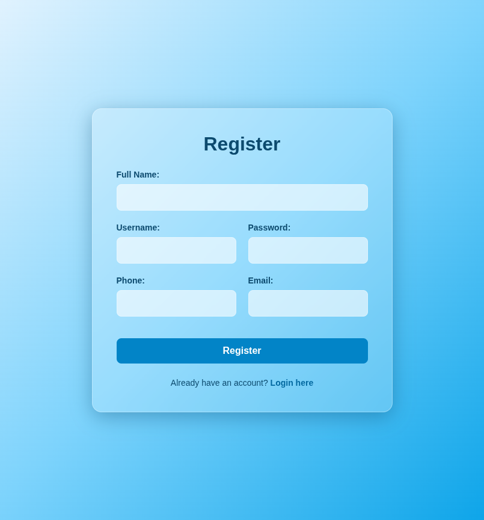
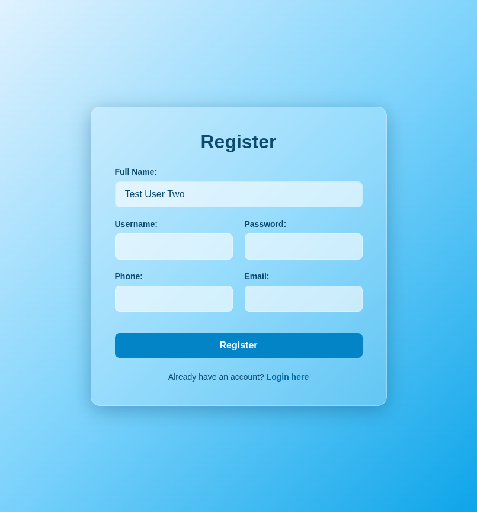
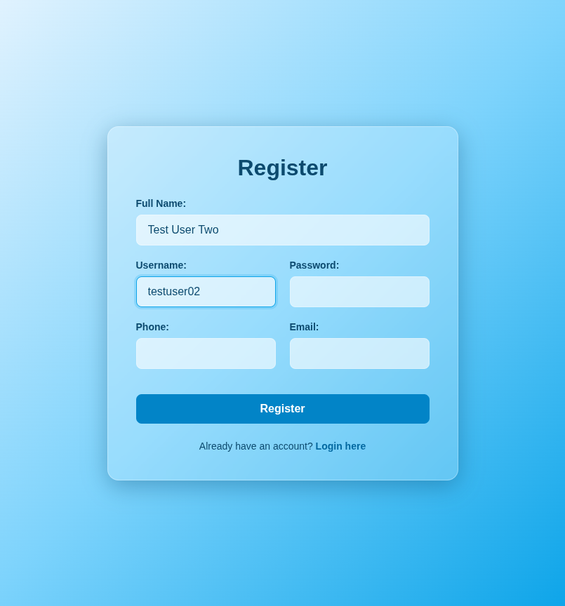
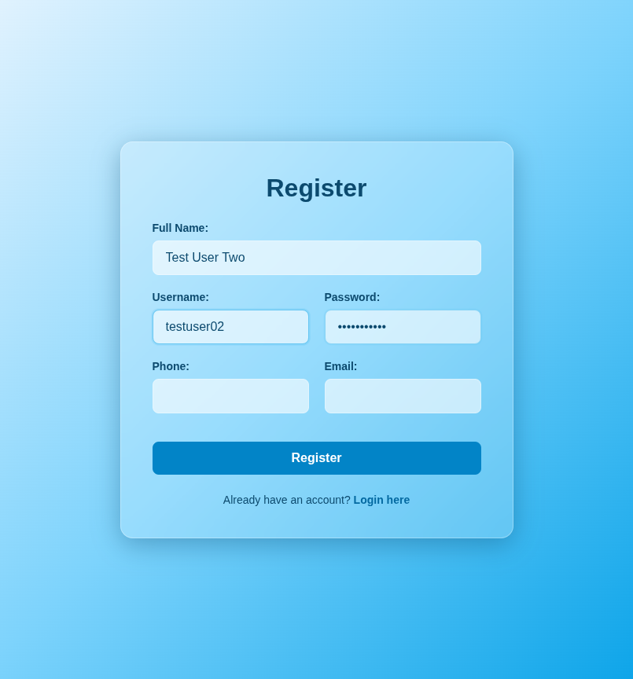
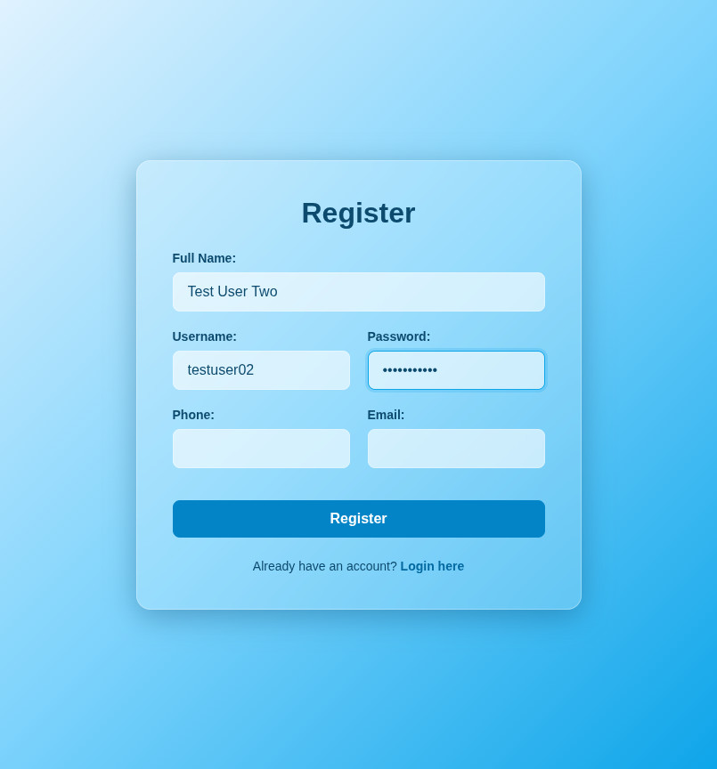
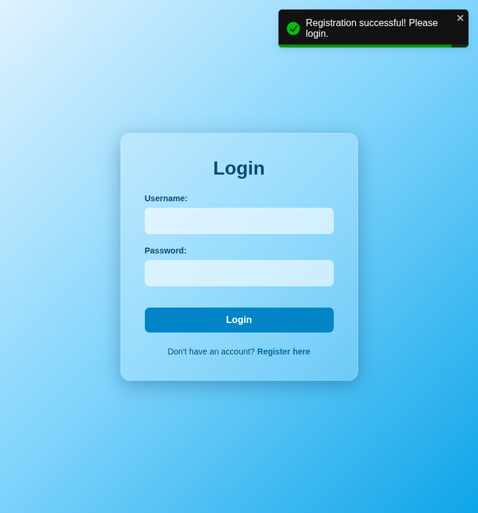

# Test Report: TC_REG_02

## Test Case Details
- **Test Case ID:** TC_REG_02
- **Scenario:** B2. User Registration - Successful (Required fields only)
- **Preconditions:** None
- **Test Data:** 
  - Full Name: `Test User Two`
  - Username: `testuser02`
  - Password: `password123`
  - Phone: (empty)
  - Email: (empty)
- **Expected Output:** Success message displayed. Navigated to login page.

## Execution Steps

### Step 1: Navigate to register page
The user successfully navigated to the register page.

### Step 2: Enter full name
The user entered the full name `Test User Two`.

### Step 3: Enter username
The user entered the valid username `testuser02`.

### Step 4: Enter password
The user entered the valid password `password123`.

### Step 5: Leave phone number empty
The user left the phone number field empty.

### Step 6: Leave email empty
The user left the email address field empty.

### Step 7: Click register button
The user clicked the register button. The system displayed a success toast notification and navigated to the login page.

## Execution Result
- **Status:** PASS
- **Details:** The system successfully registered the new user with only the required fields provided, displayed a success message, and redirected to the login page. No bugs were detected.
