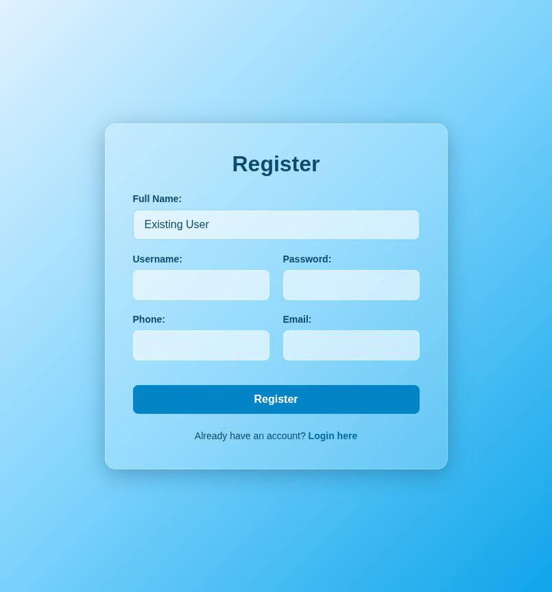
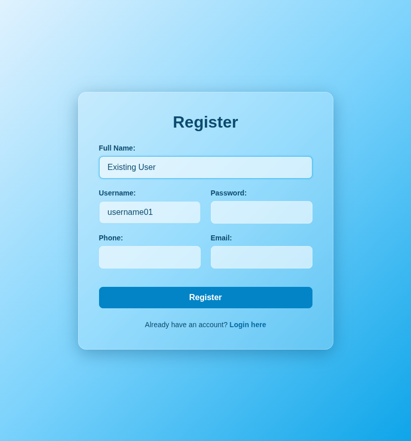
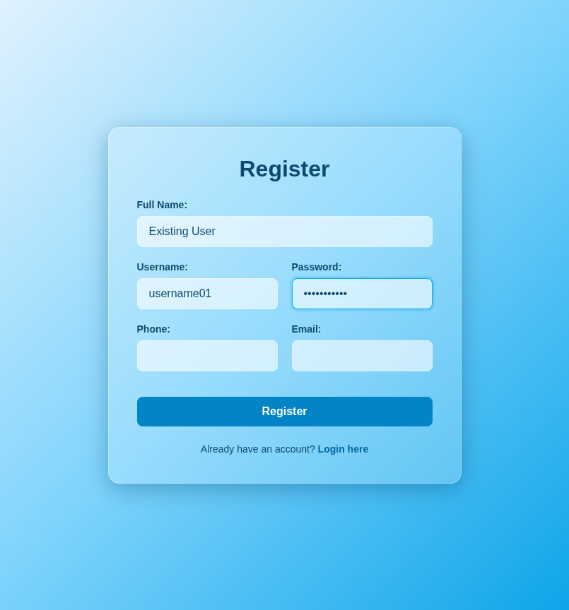
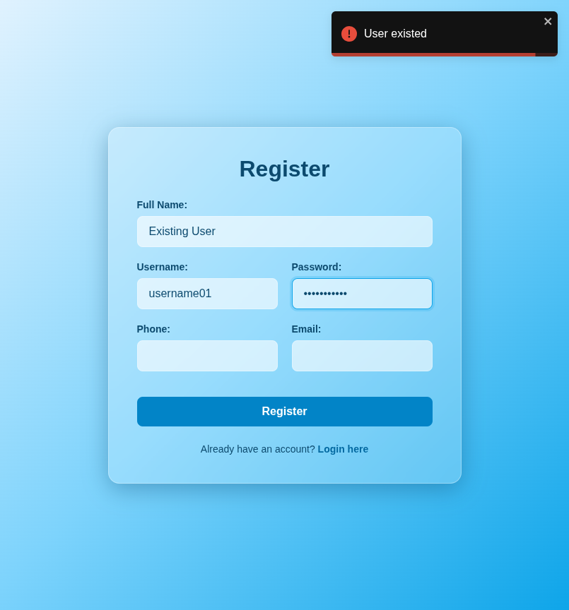

# Test Report: TC_REG_03

## Test Case Details
- **Test Case ID:** TC_REG_03
- **Scenario:** B3. User Registration - Existing Username
- **Preconditions:** System has seeded user data with username `username01`
- **Test Data:** 
  - Full Name: `Existing User`
  - Username: `username01`
  - Password: `password123`
  - Phone: (empty)
  - Email: (empty)
- **Expected Output:** Error message displayed. System remains on register page.

## Execution Steps

### Step 1: Navigate to register page
The user successfully navigated to the register page.

### Step 2: Enter full name
The user entered the full name `Existing User`.

### Step 3: Enter existing username
The user entered the username `username01` which already exists in the system.

### Step 4: Enter password
The user entered the valid password `password123`.

### Step 5: Leave phone number empty
The user left the phone number field empty.

### Step 6: Leave email empty
The user left the email address field empty.

### Step 7: Click register button
The user clicked the register button. The system displayed an error toast notification and remained on the register page.

## Execution Result
- **Status:** PASS
- **Details:** The system successfully detected the existing username, displayed an error toast (e.g., "Username already taken"), and prevented registration. The user remained on the register page. No bugs were detected.
