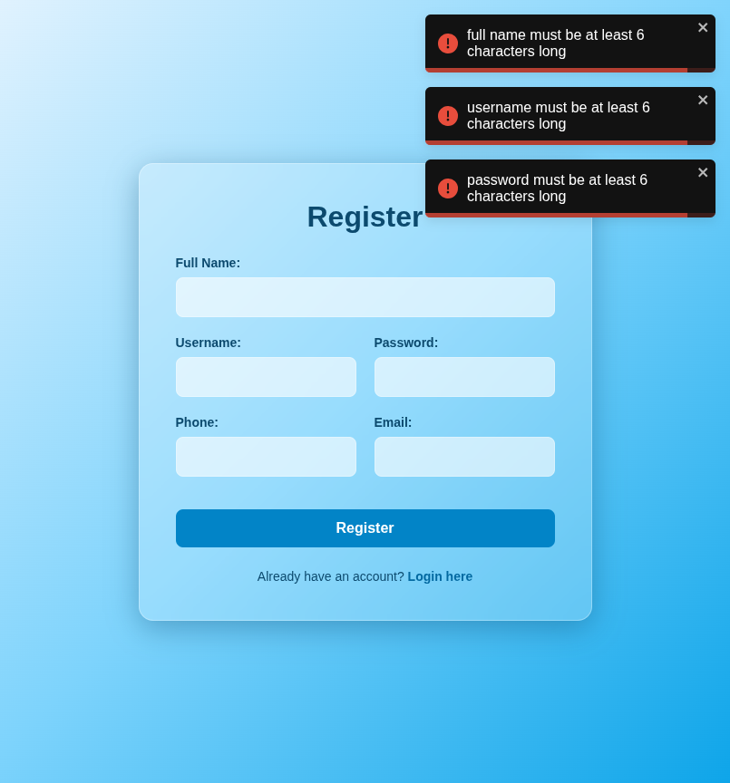

# Test Report: TC_REG_04

## Test Case Details
- **Test Case ID:** TC_REG_04
- **Scenario:** B4. User Registration - Empty Required Fields
- **Preconditions:** None
- **Test Data:** 
  - Full Name: (empty)
  - Username: (empty)
  - Password: (empty)
  - Phone: (empty)
  - Email: (empty)
- **Expected Output:** Validation errors displayed for all required fields.

## Execution Steps

### Step 1: Navigate to register page
The user successfully navigated to the register page.

### Step 2: Leave all fields empty
The user left all fields empty.

### Step 3: Click register button
The user clicked the register button. The system displayed validation error toast notifications and remained on the register page.

## Execution Result
- **Status:** PASS
- **Details:** The system successfully displayed validation errors for the empty required fields. The registration attempt was prevented, and the user remained on the register page. No bugs were detected.
