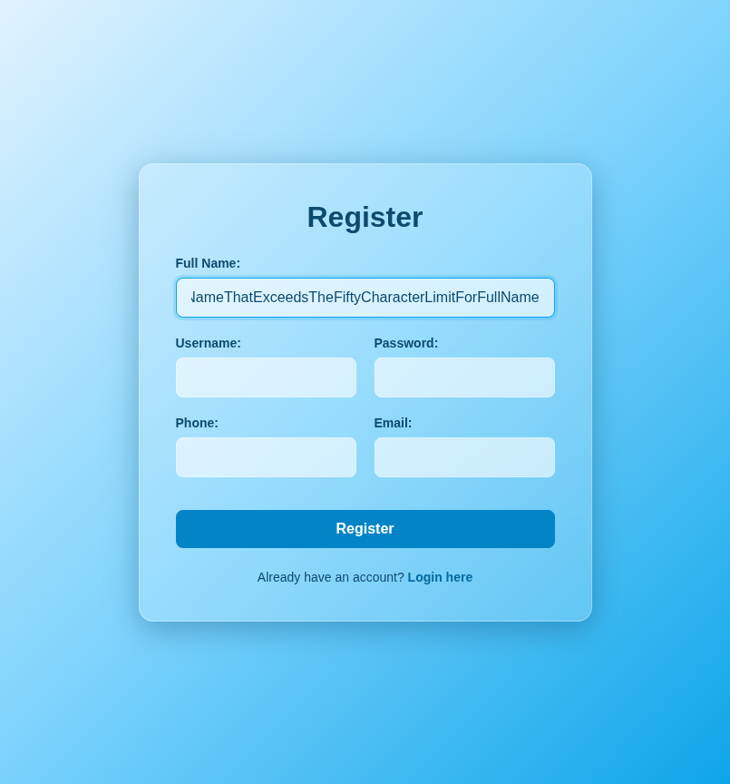
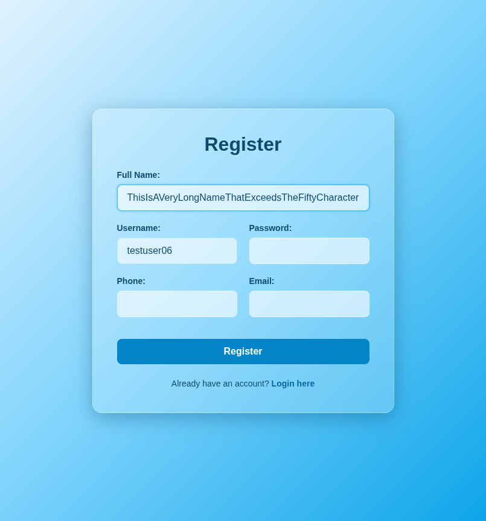
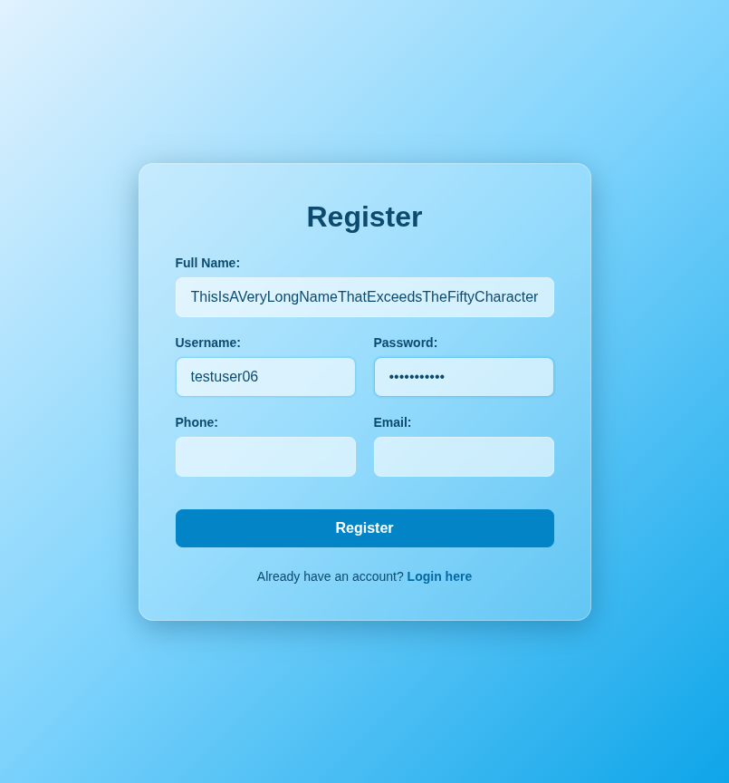
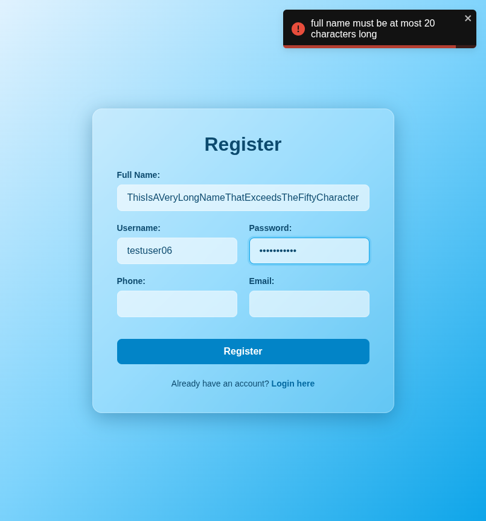

# Test Report: TC_REG_06

## Test Case Details
- **Test Case ID:** TC_REG_06
- **Scenario:** B5. User Registration - Long Full Name
- **Preconditions:** None
- **Test Data:** 
  - Full Name: `ThisIsAVeryLongNameThatExceedsTheFiftyCharacterLimitForFullName`
  - Username: `testuser06`
  - Password: `password123`
  - Phone: (empty)
  - Email: (empty)
- **Expected Output:** Validation error displayed: "Full Name must be at most 50 characters long".

## Execution Steps

### Step 1: Navigate to register page
The user successfully navigated to the register page.

### Step 2: Enter long full name
The user entered a full name exceeding 50 characters: `ThisIsAVeryLongNameThatExceedsTheFiftyCharacterLimitForFullName`.

### Step 3: Enter username
The user entered the valid username `testuser06`.

### Step 4: Enter password
The user entered the valid password `password123`.

### Step 5: Leave phone number empty
The user left the phone number field empty.

### Step 6: Leave email empty
The user left the email address field empty.

### Step 7: Click register button
The user clicked the register button. The system displayed a validation error toast notification and remained on the register page.

## Execution Result
- **Status:** PASS
- **Details:** The system successfully displayed a validation error toast indicating that the full name must be at most 50 characters long. The registration attempt was prevented, and the user remained on the register page. No bugs were detected.
