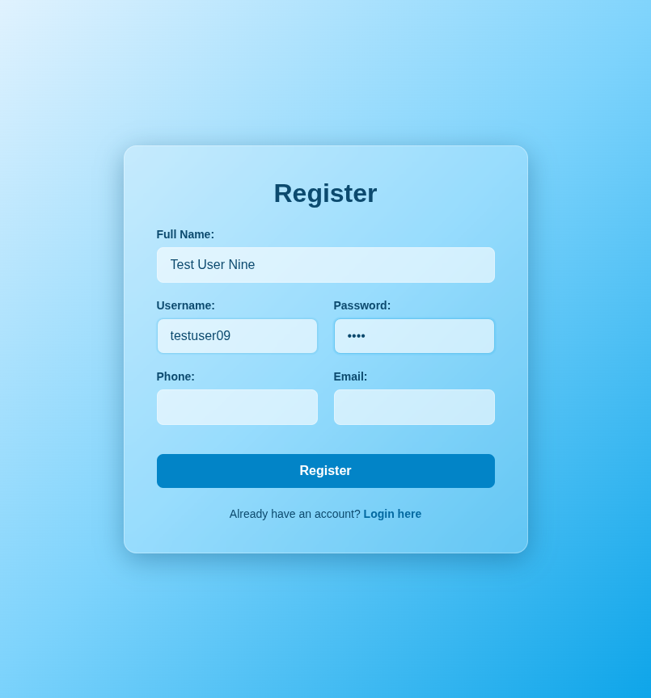
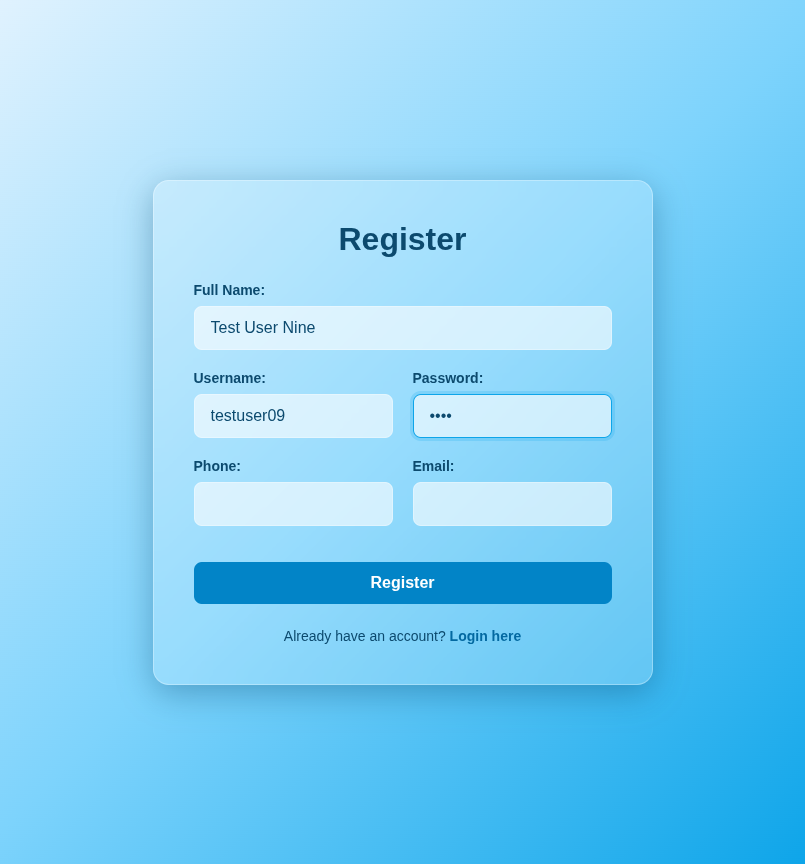
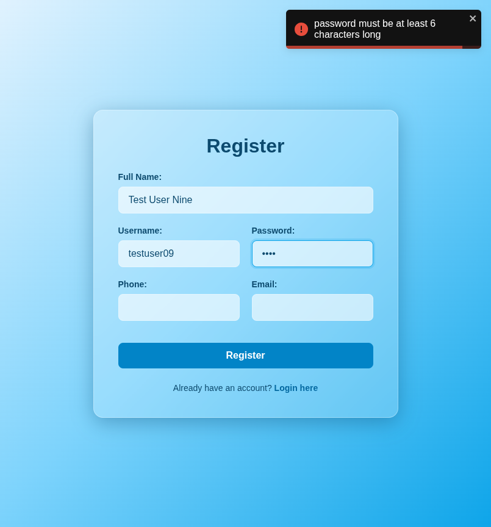

# Test Report: TC_REG_09

## Test Case Details
- **Test Case ID:** TC_REG_09
- **Scenario:** B8. User Registration - Short Password
- **Preconditions:** None
- **Test Data:** 
  - Full Name: `Test User Nine`
  - Username: `testuser09`
  - Password: `pass`
  - Phone: (empty)
  - Email: (empty)
- **Expected Output:** Validation error displayed: "Password must be at least 6 characters long".

## Execution Steps

### Step 1: Navigate to register page
The user successfully navigated to the register page.

### Step 2: Enter full name
The user entered the valid full name `Test User Nine`.

### Step 3: Enter username
The user entered the valid username `testuser09`.

### Step 4: Enter short password
The user entered a short password `pass`.

### Step 5: Leave phone number empty
The user left the phone number field empty.

### Step 6: Leave email empty
The user left the email address field empty.

### Step 7: Click register button
The user clicked the register button. The system displayed a validation error toast notification and remained on the register page.

## Execution Result
- **Status:** PASS
- **Details:** The system successfully displayed a validation error toast indicating that the password must be at least 6 characters long. The registration attempt was prevented, and the user remained on the register page. No bugs were detected.
