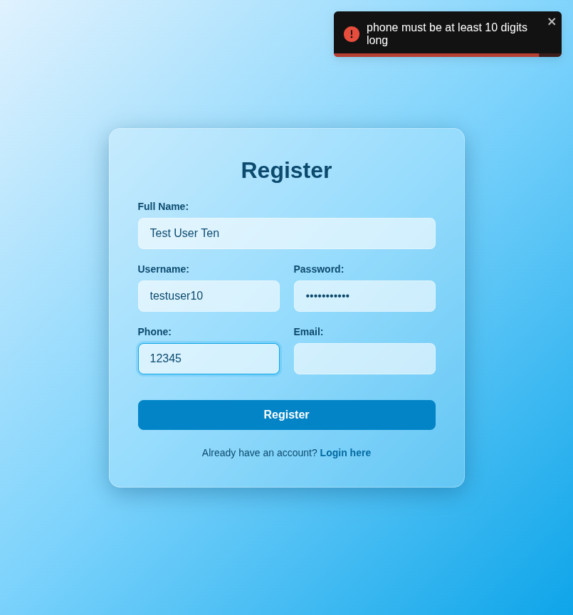

# Test Report: TC_REG_10

## Test Case Details
- **Test Case ID:** TC_REG_10
- **Scenario:** B9. User Registration - Short Phone
- **Preconditions:** None
- **Test Data:** 
  - Full Name: `Test User Ten`
  - Username: `testuser10`
  - Password: `password123`
  - Phone: `12345`
  - Email: (empty)
- **Expected Output:** Validation error displayed: "Phone number must be exactly 10 digits".

## Execution Steps

### Step 1: Navigate to register page
The user successfully navigated to the register page.

### Step 2: Enter full name
The user entered the valid full name `Test User Ten`.

### Step 3: Enter username
The user entered the valid username `testuser10`.

### Step 4: Enter password
The user entered the valid password `password123`.

### Step 5: Enter short phone number
The user entered a short phone number `12345`.

### Step 6: Leave email empty
The user left the email address field empty.

### Step 7: Click register button
The user clicked the register button. The system displayed a validation error toast notification and remained on the register page.

## Execution Result
- **Status:** PASS
- **Details:** The system successfully displayed a validation error toast indicating that the phone number must be exactly 10 digits. The registration attempt was prevented, and the user remained on the register page. No bugs were detected.
