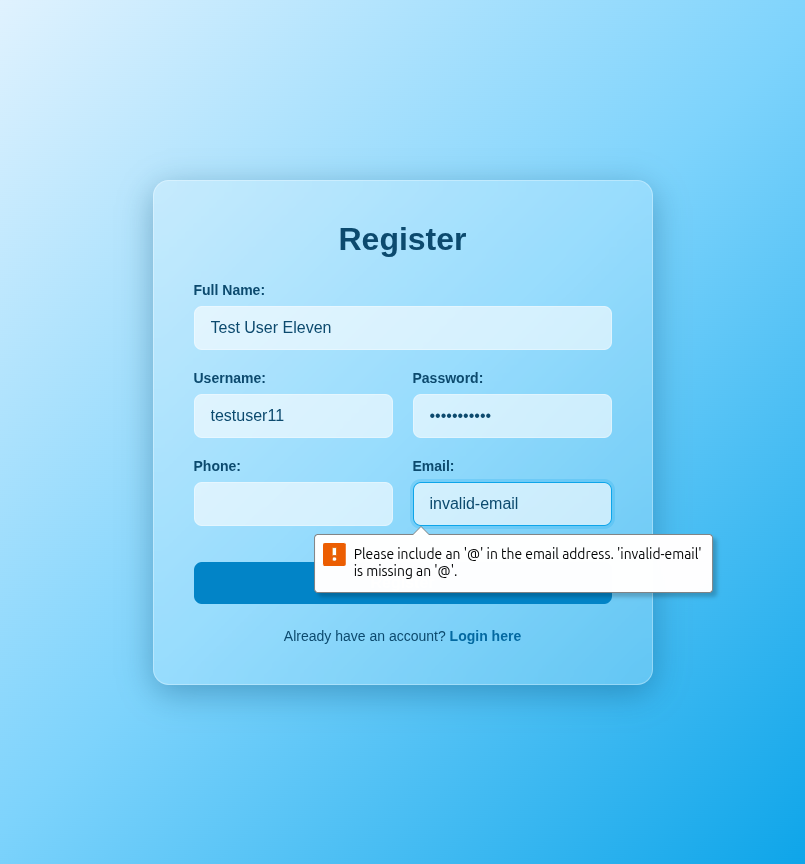

# Test Report: TC_REG_11

## Test Case Details
- **Test Case ID:** TC_REG_11
- **Scenario:** B10. User Registration - Invalid Email format
- **Preconditions:** None
- **Test Data:** 
  - Full Name: `Test User Eleven`
  - Username: `testuser11`
  - Password: `password123`
  - Phone: (empty)
  - Email: `invalid-email`
- **Expected Output:** Validation error displayed: "Invalid email format".

## Execution Steps

### Step 1: Navigate to register page
The user successfully navigated to the register page.

### Step 2: Enter full name
The user entered the valid full name `Test User Eleven`.

### Step 3: Enter username
The user entered the valid username `testuser11`.

### Step 4: Enter password
The user entered the valid password `password123`.

### Step 5: Leave phone number empty
The user left the phone number field empty.

### Step 6: Enter invalid email
The user entered an email with invalid format `invalid-email`.

### Step 7: Click register button
The user clicked the register button. The system displayed a validation error (either via browser native validation or toast) and remained on the register page.

## Execution Result
- **Status:** PASS
- **Details:** The system successfully displayed a validation error indicating that the email format is invalid. The registration attempt was prevented, and the user remained on the register page. No bugs were detected.
