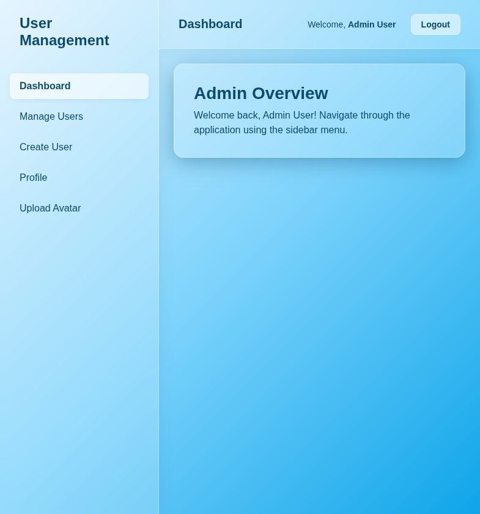

# Test Report: TC_LOG_02

## Test Case Details
- **Test Case ID:** TC_LOG_02
- **Scenario:** A1. User Login - Successful
- **Preconditions:** System has seeded admin data
- **Test Data:** 
  - Username: `admin123`
  - Password: `admin123`
- **Expected Output:** Success message displayed. Navigated to dashboard. Admin features visible.

## Execution Steps

1. **Navigate to login page**
   - Action: Loaded `http://localhost:5173/login` in the browser.
   - Playwright Command: `await page.goto('http://localhost:5173/login');`
2. **Enter username**
   - Action: Filled the username input.
   - Interacted DOM Element: Input field with `data-testid="login-username-input"`.
   - Playwright Locator: `await page.getByTestId('login-username-input').fill('admin123');`
3. **Enter password**
   - Action: Filled the password input.
   - Interacted DOM Element: Input field with `data-testid="login-password-input"`.
   - Playwright Locator: `await page.getByTestId('login-password-input').fill('admin123');`
4. **Click login button**
   - Action: Clicked the submit button.
   - Interacted DOM Element: Button with `type="submit"`.
   - Playwright Locator: `await page.evaluate('() => document.querySelector(\'button[type="submit"]\').click()');`

## Execution Result
- **Status:** PASS
- **Details:** The system successfully authenticated the admin user and navigated to the `/dashboard` route. Admin features were visible on the dashboard.

## Evidence (Final Result)

