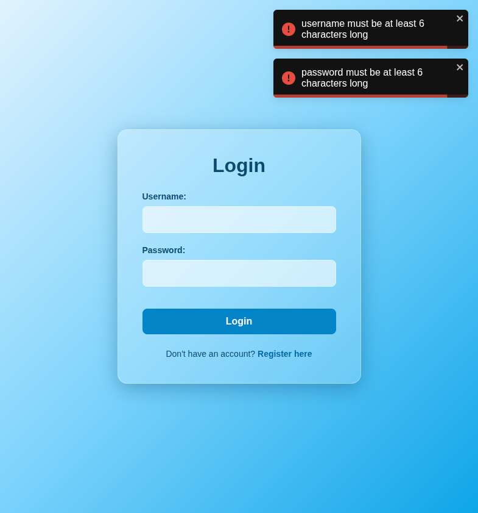

# Test Report: TC_LOG_05

## Test Case Details
- **Test Case ID:** TC_LOG_05
- **Scenario:** A4. User Login - Empty Fields
- **Preconditions:** None
- **Test Data:** 
  - Username: (empty)
  - Password: (empty)
- **Expected Output:** Validation errors displayed: "username must be at least 6 characters long", "password must be at least 6 characters long".

## Execution Steps

1. **Navigate to login page**
   - Action: Loaded `http://localhost:5173/login` in the browser.
   - Playwright Command: `await page.goto('http://localhost:5173/login');`
2. **Leave fields empty**
   - Action: Interacted with neither the username (`data-testid="login-username-input"`) nor password (`data-testid="login-password-input"`) input fields.
3. **Click login button**
   - Action: Clicked the submit button.
   - Interacted DOM Element: Button with `type="submit"`.
   - Playwright Locator: `await page.evaluate('() => document.querySelector(\'button[type="submit"]\').click()');`

## Execution Result
- **Status:** PASS
- **Details:** The system successfully prevented the login and remained on the login page. Appropriate validation error notifications were shown for the empty username and password fields.

## Evidence (Final Result)

