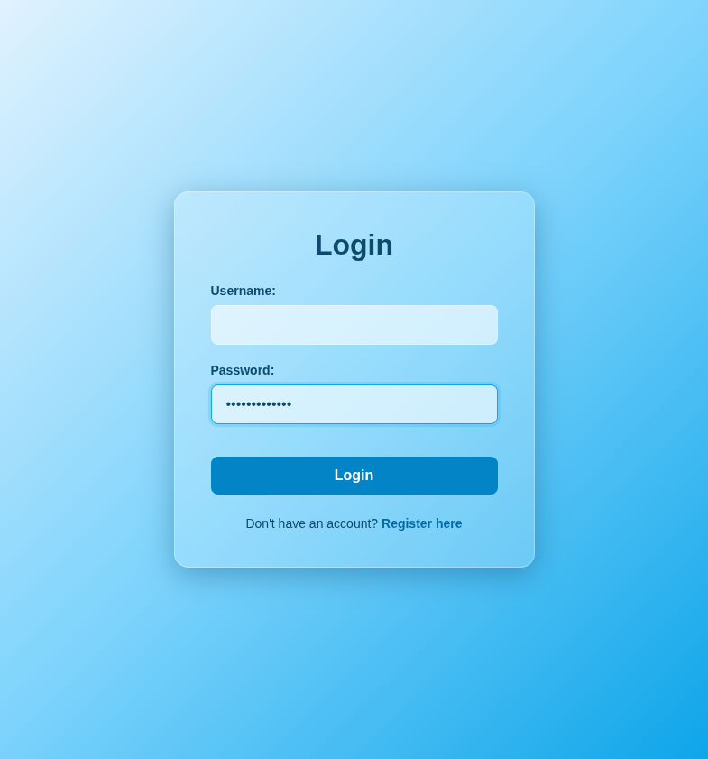

# Test Report: TC_LOG_06

## Test Case Details
- **Test Case ID:** TC_LOG_06
- **Scenario:** A4. User Login - Empty Fields
- **Preconditions:** None
- **Test Data:** 
  - Username: (empty)
  - Password: `userpassword1`
- **Expected Output:** Validation error displayed: "username must be at least 6 characters long".

## Execution Steps

1. **Navigate to login page**
   - Action: Loaded `http://localhost:5173/login` in the browser.
   - Playwright Command: `await page.goto('http://localhost:5173/login');`
2. **Leave username empty**
   - Action: Did not interact with the username input.
3. **Enter password**
   - Action: Filled the password input.
   - Interacted DOM Element: Input field with `data-testid="login-password-input"`.
   - Playwright Locator: `await page.getByTestId('login-password-input').fill('userpassword1');`
4. **Click login button**
   - Action: Clicked the submit button.
   - Interacted DOM Element: Button with `type="submit"`.
   - Playwright Locator: `await page.evaluate('() => document.querySelector(\'button[type="submit"]\').click()');`

## Execution Result
- **Status:** PASS
- **Details:** The system successfully prevented the login and remained on the login page. An appropriate validation error notification was shown for the empty username field.

## Evidence (Final Result)

