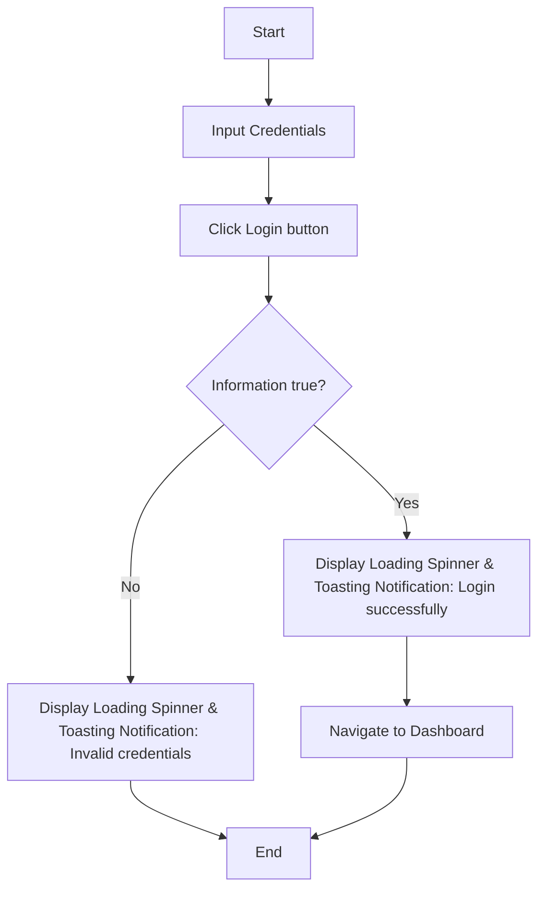
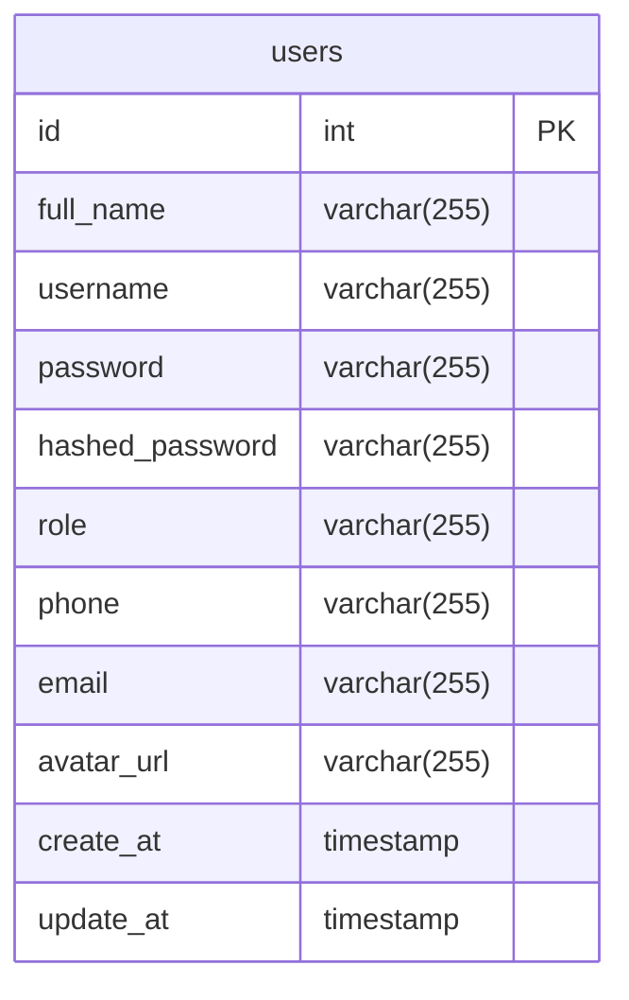

# Use cases

## 1. Backend Constraints & Business Rules

Based on backend analysis ([zod.schemas.ts](file:///home/huycao/Desktop/intern-project/backend/src/utils/zod.schemas.ts), [schema.prisma](file:///home/huycao/Desktop/intern-project/backend/prisma/schema.prisma), [auth.middlewares.ts](file:///home/huycao/Desktop/intern-project/backend/src/middlewares/auth.middlewares.ts), [role.middlewares.ts](file:///home/huycao/Desktop/intern-project/backend/src/middlewares/role.middlewares.ts)):

| Entity / Field | Validation Rule | Constraints & Behavior |
| :--- | :--- | :--- |
| **`username`** | String | Min 6 chars, Max 20 chars. Must be **unique**. Automatically lowercased on login. |
| **`password`** | String | Min 6 chars, Max 20 chars. Hashed with bcrypt (salt rounds: 4). |
| **`full_name`** | String | Min 6 chars, Max 20 chars. Required for registration and profile updates. |
| **`phone`** | String (Optional) | Min 10 digits, Max 15 digits. Nullish allowed. |
| **`email`** | String (Optional) | Valid email format. Must be **unique**. Nullish allowed. |
| **`role`** | Enum | Allowed values: `'user'` or `'admin'`. |
| **`token`** | JWT Bearer | Token required in `Authorization: Bearer <token>` header for protected routes. |
| **Avatar Upload** | Multipart/form-data | Image file required. Stored at `/uploads/avatars/`. Returns 406 if file missing. |
| **CSV Upload** | Multipart/form-data | `.csv` file required. Parsed server-side to update profile fields. |

---

## 2. Actors

* **User**: Authenticated user with role `'user'`. Access restricted to own profile, avatar, and CSV profile update.
* **Admin**: Authenticated user with role `'admin'`. Full system permissions over all user records (create, list, view, update, delete, export).
* **Anonymous User**: Unauthenticated visitor accessing public auth endpoints (`/register`, `/login`).

---

## 3. Use cases of User Management App

***Actor: Base User***

| Use case | Description | Pre-conditions |
| --- | --- | --- |
| **Register** | User registers for an account | Unauthenticated |
| **Login** | User logs in with username and password | Registered user account exists |
| **Logout** | User logs out of the application | Logged in |
| **View profile** | User views their own profile | Logged in |
| **Update information** | User updates their phone, email, full name | Logged in as profile owner |
| **Upload avatar** | User uploads personal avatar image | Logged in as profile owner |

***Actor: Admin***

> *(Admin inherits all Base User use cases and possesses elevated system management permissions)*

| Use case | Description | Pre-conditions |
| --- | --- | --- |
| **Create user** | Admin creates a new user account | Logged in as Admin |
| **Delete user** | Admin deletes a user account | Logged in as Admin |
| **View users** | Admin views all users in a table | Logged in as Admin |
| **View user's detail** | Admin views user's detailed profile | Logged in as Admin |
| **Export users list's file** | Admin exports users table as CSV file | Logged in as Admin |

---

## 4. Scenarios (Interactions of Actors with UI)

> **Golden Rule**: Odd step is System (UI rendering, loading spinners, notifications, page navigation), Even step is User (input entry, button clicks, file selection).

### Scenarios Table Overview

| Use case | Scenario | Steps |
| :--- | :--- | :--- |
| **Login** | User login successfully | 1. System displays login page 2. User enters username and password, then clicks Login button 3. System displays loading spinner, validates user, displays toasting notification `"Login successfully"`, and navigates to dashboard page |
| **Login** | User login failed | 1. System displays login page 2. User enters invalid username or password, then clicks Login button 3. System displays loading spinner, validates user, and displays toasting notification `"Cannot find user"` or `"Invalid password"` |
| **Register** | User register successfully | 1. System displays register page 2. User enters registration details and clicks Register button 3. System displays loading spinner, registers user, displays toasting notification `"User created successfully"`, and navigates to login page |
| **Register** | User register failed | 1. System displays register page 2. User enters existing username and clicks Register button 3. System displays loading spinner, validates username, and displays toasting notification `"User existed"` |
| **View Users** | Admin views user table | 1. System displays sidebar menu 2. Admin clicks Manage Users button 3. System displays loading spinner, fetches users list, and displays user table with search, pagination, and export controls |
| **View Detail** | Admin views user's detail | 1. System displays user table 2. Admin clicks View Profile button on a specific user's row 3. System displays loading spinner, fetches user detail, and navigates to User Detail page |
| **Create User** | Admin creates user successfully | 1. System displays Create User form 2. Admin enters user details and clicks Create User button 3. System displays loading spinner, validates data, creates user in database, displays toasting notification `"User created successfully"`, and navigates to Manage Users page |
| **Delete User** | Admin deletes a user | 1. System displays User Detail page with Delete User button 2. Admin clicks Delete User button 3. System displays confirmation modal dialog 4. Admin clicks Confirm button 5. System displays loading spinner, deletes user, displays toasting notification `"User deleted successfully"`, and navigates to Manage Users page |
| **View Profile** | User views their detail | 1. System displays sidebar menu 2. User clicks Profile button 3. System displays loading spinner, fetches profile data, and displays Profile screen with user information |
| **Update Info** | User updates information | 1. System displays Profile screen 2. User enters new information and clicks Update Profile button 3. System displays loading spinner, updates information in database, displays toasting notification `"Profile updated successfully"`, and displays updated values |
| **Upload Avatar** | User uploads avatar | 1. System displays Upload Avatar screen 2. User selects an image file and clicks Upload button 3. System displays loading spinner, processes upload, updates avatar URL, displays toasting notification `"Avatar uploaded successfully"`, and renders updated avatar image |
| **Export Users** | Admin exports users table as CSV | 1. System displays Manage Users screen 2. Admin clicks Export CSV button 3. System displays loading spinner, requests export data from server, displays toasting notification `"Export file successfully"`, and automatically triggers download of `users_export.csv` file |

---

### Detailed Interaction Steps

#### A. User Login

1. System displays login page including login form: username field, password field, login button
2. User enters username and password and clicks login button
3. System displays loading spinner while validating credentials, displays toasting notification `"Login successfully"`, and navigates to dashboard page

#### B. User Register

1. System displays login page including a link to the register page
2. User clicks on the link to the register page
3. System displays register page including register form: Full Name, Username, Password, Phone, Email fields, and Register button
4. User enters registration details and clicks Register button
5. System displays loading spinner while registering user, displays toasting notification `"User created successfully"`, and navigates back to login page

#### C. Admin view user table

1. System displays sidebar navigation menu including Manage Users button
2. Admin clicks Manage Users button in the Sidebar
3. System displays loading spinner while fetching users, then displays screen including user table (ID, Username, Full Name, Actions), search form, pagination controls, and export button

#### D. Admin view user's detail

1. System displays screen including user table with View Profile button on each user row
2. Admin clicks "View Profile" button on a specific user's row
3. System displays loading spinner while fetching user profile, then navigates to screen displaying user's detail: ID, Username, Full Name, Phone, Email, Role, and Delete User button

#### E. Admin create user

1. System displays screen including Create User form: Full Name, Username, Password, Phone, Email fields, Role selector, and Create User button
2. Admin enters required details and clicks Create User button
3. System displays loading spinner while validating and creating user, displays toasting notification `"User created successfully"`, and navigates back to Manage Users page

#### F. Admin delete a user

1. System displays User Detail screen including Delete User button
2. Admin clicks Delete User button
3. System displays confirmation prompt dialog with Confirm and Cancel buttons
4. Admin clicks Confirm button
5. System displays loading spinner while deleting user, displays toasting notification `"User deleted successfully"`, and navigates back to Manage Users page

#### G. User view their detail

1. System displays sidebar navigation menu including Profile button
2. User clicks Profile button in the Sidebar
3. System displays loading spinner while fetching profile, then displays Profile screen including sections for CSV Update and Manual Update, showing current Full Name, Username (disabled), Phone, and Email

#### H. User update their information

1. System displays Profile screen with editable fields and Update Profile button
2. User enters new information (Full Name, Phone, Email) in Manual Update form and clicks "Update Profile" button (or selects CSV file and clicks "Upload CSV")
3. System displays loading spinner while updating database, displays toasting notification `"Profile updated successfully"`, and updates displayed profile details

#### I. User upload avatar

1. System displays Upload Avatar screen with file input and Upload button
2. User selects an image file
3. System displays visual preview of selected image
4. User clicks Upload button
5. System displays loading spinner while processing upload, saves avatar URL to profile, displays toasting notification `"Avatar uploaded successfully"`, and renders updated avatar

#### J. Admin export users table as CSV file

1. System displays Manage Users screen including Export CSV button
2. Admin clicks 'Export CSV' button
3. System displays loading spinner while preparing CSV file, displays toasting notification `"Export file successfully"`, and automatically triggers download of `users_export.csv` file

---

## 5. Flowcharts

### 1. User Login

---

## 6. Database Design

### Entity

1. User: Store user's information and their role (Admin or User)

### Entity's attributes

1. User

* id
* full_name
* username
* password
* hashed_password
* role
* phone
* email
* avatar_url

### Schema

1. users

* id: primary key, auto increment
* full_name: varchar(255), not null
* username: varchar(255), unique, not null
* password: varchar(255), not null
* hashed_password: varchar(255), not null
* role: varchar(255), not null
* phone: varchar(255)
* email: varchar(255)
* avatar_url: varchar(255)
* create_at: timestamp
* update_at: timestamp

### ERD

### Data dictionary

| Attribute | Data type | Description |
| --- | --- | --- |
| id | int | Primary key |
| full_name | varchar(255) | Storing user's full name |
| username | varchar(255) | Storing user's username |
| password | varchar(255) | Storing user's password |
| hashed_password | varchar(255) | Storing user's hashed password |
| role | varchar(255) | Storing user's role |
| phone | varchar(255) | Storing user's phone |
| email | varchar(255) | Storing user's email |
| avatar_url | varchar(255) | Storing user's avatar url in local storage |
| create_at | timestamp | Storing user's created at |
| update_at | timestamp | Storing user's updated at |
