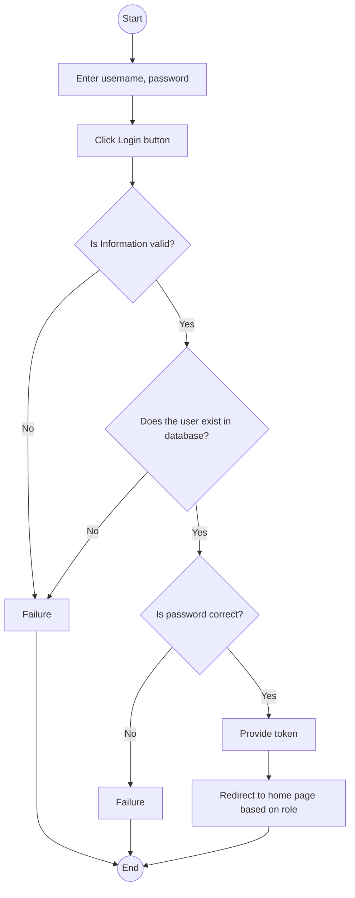

# User Login flow

```mermaid
flowchart TD
    A@{shape: circle, label: "Start"} --> B[Enter username, password]
    B --> B1[Click Login button]
    B1 --> C{Is Information valid?}
    C -->|Yes| D{Does the user exist in database?}
    C -->|No| E[Failure]
    D -->|Yes| F1{Is password correct?}
    D -->|No| E[Failure]
    E --> G@{shape: circle, label: "End"}
    F1 -->|Yes| H[Provide token]
    F1 -->|No| I[Failure]
    H --> J[Redirect to home page based on role]
    I --> G
    J --> G
```
