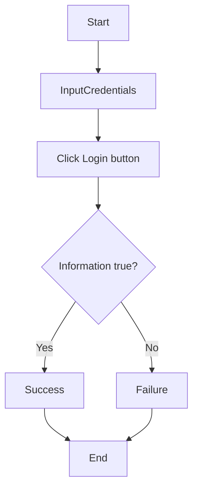
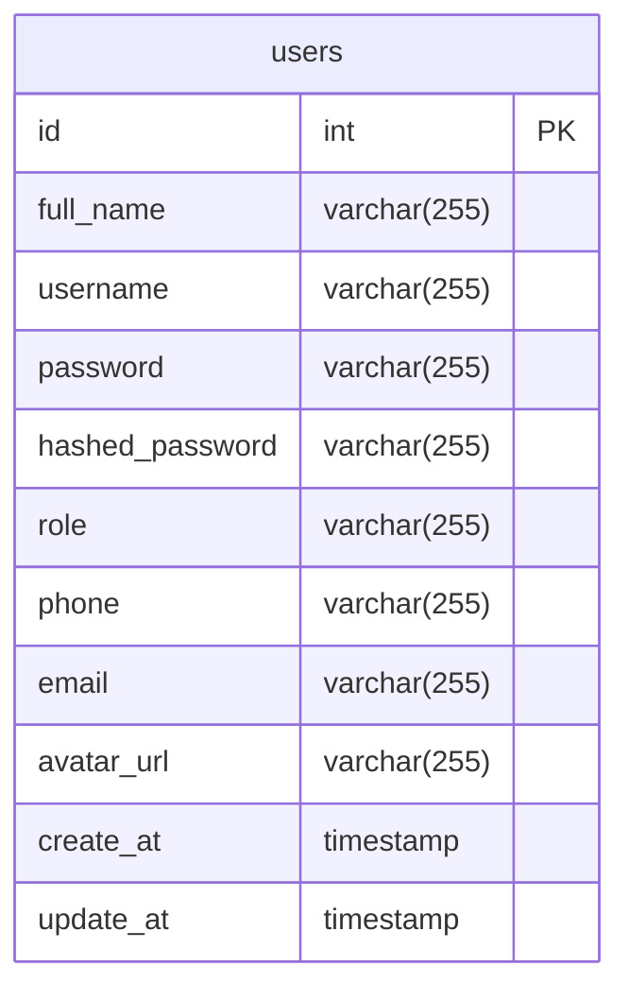

# Use cases

## Actors

* Admin
* User

## Use cases of User Management App

| Actors | Use cases | Description |
| --- | --- | --- |
| **User** | | |
| | Register | User registers for an account |
| | Login | User logs in with username and password |
| | Logout | User logs out |
| | View profile | User views their profile |
| | Update information | User update their phone, email |
| | Upload avatar | User uploads avatar |
| **Admin** | | |
| (admin is provided all permissions of user) | | |
| | Create user | Admin creates a new user |
| | Delete user | Admin deletes a user |
| | View users | Admin views all users |
| | View user's detail | Admin views user's detail |
| | Export users list's file | Admin exports users table as CSV file |

## Scenarios (interactions of actors with UI)

### A. User Login

1. User opens login page
2. System displays login page including login form: username field, password field, login button
3. User enters username and password and clicks login button
4. System validates username and password and navigates to the dashboard, displaying a success message

### B. User Register

1. User opens login page
2. System displays login page including a link to the register page
3. User clicks on the link to the register page
4. System displays register page including register form: Full Name, Username, Password, Phone, and Email fields, along with a Register button
5. User enters details and clicks the Register button
6. System validates the data, registers the user, displays a success message, and navigates back to the login page

### C. Admin view user table

**Precondition**:

* Admin has logged in

**Steps**:

1. Admin clicks Manage Users button in the Sidebar
2. System displays a screen including the user table (ID, Username, Full Name, Actions), search form, pagination controls, and export button

### D. Admin view user's detail

**Precondition**:

* Admin has logged in

**Steps**:

1. Admin clicks Manage Users button in the Sidebar
2. System displays a screen including the user table
3. Admin clicks the "View Profile" button on a specific user's row
4. System navigates to a screen displaying the user's detail: ID, Username, Full Name, Phone, Email, Role, and a Delete User button

### E. Admin create user

**Precondition**:

* Admin has logged in

**Steps**:

1. Admin clicks Create User button in the Sidebar
2. System displays a screen including the Create User form: Full Name, Username, Password, Phone, and Email fields
3. Admin enters the required details and clicks the Create User button
4. System validates the information, creates the user, displays a success message, and navigates back to the Manage Users page

### F. Admin delete a user

**Precondition**:

* Admin has logged in

**Steps**:

1. Admin clicks Manage Users button in the Sidebar
2. System displays a screen including the user table
3. Admin clicks the "View Profile" button on a specific user's row
4. System navigates to a screen displaying the user's detail
5. Admin clicks the "Delete User" button
6. System displays a confirmation prompt. Admin confirms the deletion
7. System deletes the user, displays a success message, and navigates back to the Manage Users page

### G. User view their detail

**Precondition**:

* User has logged in

**Steps**:

1. User clicks Profile button in the Sidebar
2. System displays the Profile screen including sections for CSV Update and Manual Update, showing current Full Name, Username (disabled), Phone, and Email

### H. User update their information

**Precondition**:

* User has logged in

**Steps**:

1. User clicks Profile button in the Sidebar
2. System displays the Profile screen
3. User enters new information (Full Name, Phone, Email) in the Manual Update form and clicks the "Update Profile" button (or alternatively, selects a CSV file and clicks "Upload CSV")
4. System validates information, updates it in the database, and displays a success message

### I. User upload avatar

**Precondition**:

* User has logged in

**Steps**:

1. User clicks Upload Avatar button in the Sidebar
2. System displays a screen with a file input for the avatar
3. User selects an image file. System displays a visual preview of the selected image
4. User clicks the Upload button
5. System processes the upload, saves the avatar URL to the user profile, and displays a success message

### J. Admin export users table as CSV file

**Precondition**:

* Admin has logged in

**Steps**:

1. Admin clicks Manage Users button in the Sidebar
2. System displays a screen including the user table
3. Admin clicks the 'Export CSV' button
4. System requests the export data from the server and prepares the CSV file
5. System displays a success message and automatically triggers the download of the `users_export.csv` file

## Flowcharts

### 1. User Login

### Database Design

## Entity

1. User: Store user's information and their role (Admin or User)

## Entity's attibutes

1. User

* id
* full_name
* username
* password
* hashed_password
* role
* phone
* email
* avatar_url

## Schema

1. users

* id: primary key, auto increment
* full_name: varchar(255), not null
* username: varchar(255), unique, not null
* password: varchar(255), not null
* hashed_password: varchar(255), not null
* role: varchar(255), not null
* phone: varchar(255)
* email: varchar(255)
* avatar_url: varchar(255)
* create_at: timestamp
* update_at: timestamp

## ERD

### Data dictionary

| Attribute | Data type | Description |
| --- | --- | --- |
| id | int | Primary key |
| full_name | varchar(255) | Storing user's full name |
| username | varchar(255) | Storing user's username |
| password | varchar(255) | Storing user's password |
| hashed_password | varchar(255) | Storing user's hashed password |
| role | varchar(255) | Storing user's role |
| phone | varchar(255) | Storing user's phone |
| email | varchar(255) | Storing user's email |
| avatar_url | varchar(255) | Storing user's avatar url in local storage |
| create_at | timestamp | Storing user's created at |
| update_at | timestamp | Storing user's updated at |
