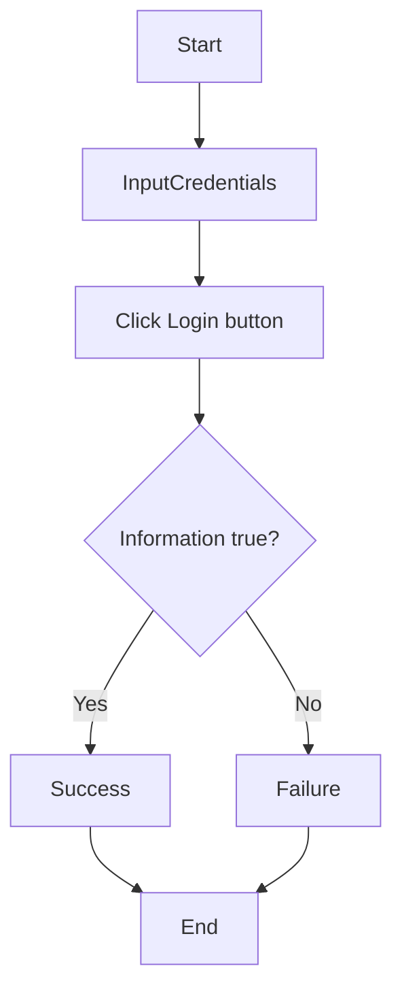
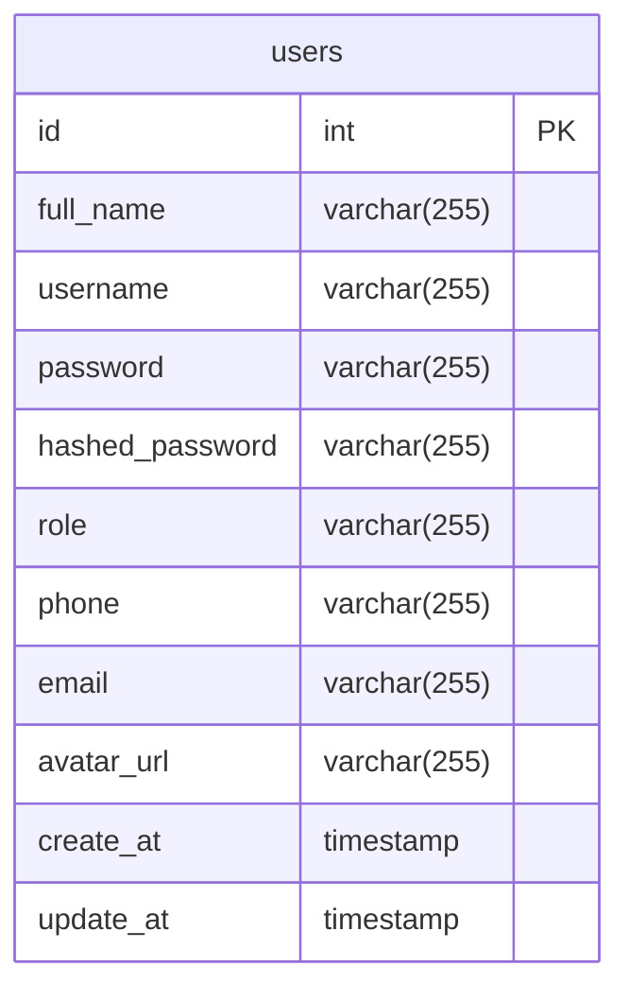

# Use cases

## Actors

* Admin
* User

## Use cases of User Management App

| Actors | Use cases | Description |
| --- | --- | --- |
| **User** | | |
| | Register | User registers for an account |
| | Login | User logs in with username and password |
| | Logout | User logs out |
| | View profile | User views their profile |
| | Update information | User update their phone, email |
| | Upload avatar | User uploads avatar |
| **Admin** | | |
| (admin is provided all permissions of user) | | |
| | Create user | Admin creates a new user |
| | Delete user | Admin deletes a user |
| | View users | Admin views all users |
| | View user's detail | Admin views user's detail |
| | Export users list's file | Admin exports users table as CSV file |

## Scenarios (interactions of actors with UI)

### A. User Login

1. User open login page
2. System displays login page including login form: username field, password field, login button
3. User enters username and password and clicks login button
4. System validates username and password and display a success message

### B. User Register

1. User open login page
2. System displays login page including link to register page
3. User clicks on link to the register page
4. System displays register page including register form: username field, password field, confirm password field, register button
5. User enters username, password and confirm password and clicks register button
6. System validates username, password and open home page based on role of user

### C. Admin view user table

**Precondition**:

* Admin has logged in

**Steps**:

1. Admin clicks view user table button in Dashboard
2. System displays a screen including user table: user's id, username

### D. Admin view user's detail

**Precondition**:

* Admin has logged in

**Steps**:

1. Admin clicks view user table button in Dashboard
2. System displays a screen including user table: user's id, username
3. Admin clicks on a line of user table
4. System displays a screen including user's detail: id, username, phone, email.

### E. Admin create user

**Precondition**:

* Admin has logged in

**Steps**:

1. Admin clicks create user button in Dashboard
2. System displays a screen including user's form: username field, password field, create button
3. Admin enters username, password and confirm password and clicks create button
4. System validates username, password and creates user. Then, system displays a success message

### F. Admin delete a user

**Precondition**:

* Admin has logged in

**Steps**:

1. Admin clicks view user table button in Dashboard
2. System displays a screen including user table: user's id, username
3. Admin clicks on a line of user table
4. System displays a screen including user's detail: id, username, phone, email
5. Admin clicks delete button
6. System validates information and deletes user. Then, system displays a success message

### G. User view their detail

**Precondition**:

* User has logged in

**Steps**:

1. User clicks profile button in Dashboard
2. System displays a screen including user's form: username, phone, email

### H. User update their information

**Precondition**:

* User has logged in

**Steps**:

1. User clicks update information button in Dashboard
2. System displays a screen including user's form: username, phone, email
3. User enters new information and clicks update button
4. System validates information and updates it. Then, system displays a success message

### I. User upload avatar

**Precondition**:

* User has logged in

**Steps**:

1. User clicks upload avatar button/link in Dashboard (or profile)
2. System displays a screen with a file upload form for the avatar
3. User selects an image file and clicks upload button
4. System processes the upload, saves the avatar, and displays a success message
5. System displays the newly uploaded avatar in the UI

### J. Admin export users table as CSV file

**Precondition**:

* Admin has logged in

**Steps**:

1. Admin clicks view user table button in Dashboard
2. System displays a screen including user table
3. Admin clicks the 'Export to CSV' button
4. System prepares the CSV file containing user data (with a simulated delay)
5. System prompts the admin to download the generated CSV file

## Flowcharts

### 1. User Login

### Database Design

## Entity

1. User: Store user's information and their role (Admin or User)

## Entity's attibutes

1. User

* id
* full_name
* username
* password
* hashed_password
* role
* phone
* email
* avatar_url

## Schema

1. users

* id: primary key, auto increment
* full_name: varchar(255), not null
* username: varchar(255), unique, not null
* password: varchar(255), not null
* hashed_password: varchar(255), not null
* role: varchar(255), not null
* phone: varchar(255)
* email: varchar(255)
* avatar_url: varchar(255)
* create_at: timestamp
* update_at: timestamp

## ERD

### Data dictionary

| Attribute | Data type | Description |
| --- | --- | --- |
| id | int | Primary key |
| full_name | varchar(255) | Storing user's full name |
| username | varchar(255) | Storing user's username |
| password | varchar(255) | Storing user's password |
| hashed_password | varchar(255) | Storing user's hashed password |
| role | varchar(255) | Storing user's role |
| phone | varchar(255) | Storing user's phone |
| email | varchar(255) | Storing user's email |
| avatar_url | varchar(255) | Storing user's avatar url in local storage |
| create_at | timestamp | Storing user's created at |
| update_at | timestamp | Storing user's updated at |
